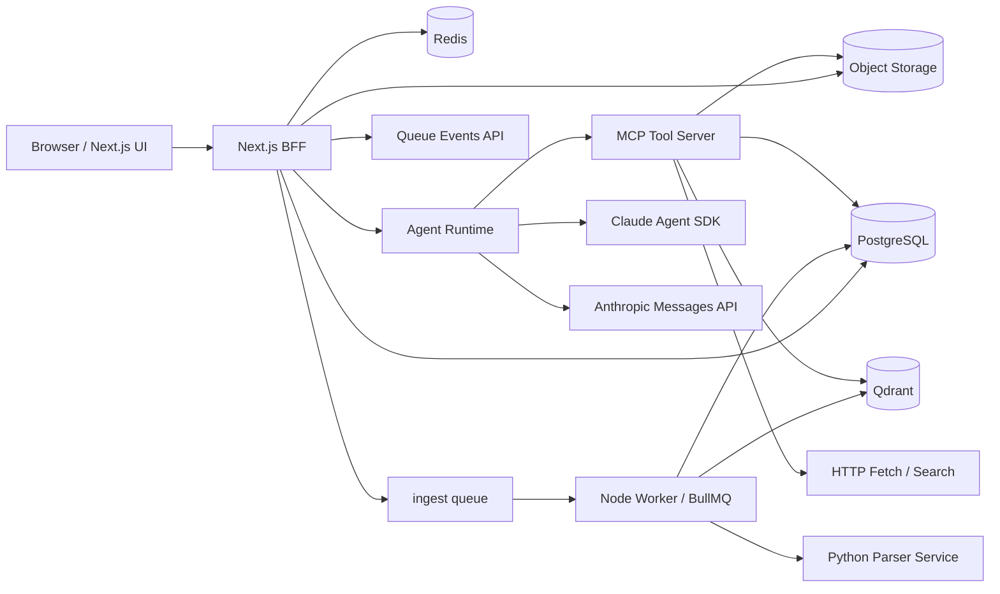

# AnchorDesk技术设计（Node.js / Next.js / Claude Agent SDK）

版本：v0.11
日期：2026-04-01

> 文档角色说明：
>
> - 本文件是当前实现的架构/技术约束主文档。
> - 当前阶段进度、活跃待办和下一步顺序请看 [implementation-tracker.md](./implementation-tracker.md)。
> - 本地开发启动、Docker 依赖和日常操作请看 [development-setup.md](./development-setup.md)。
> - 若与其他支持性文档冲突，以本文件为准。

## 1. 已确认约束

- 产品定位是“通用工作空间知识库助手”，不是法律垂类产品。
- 仍保留一个专项的“法律条文搜索”工具，用于需要法规引用的任务。
- 主站和主后端使用 Node.js。
- Web 框架使用 Next.js。
- 文档解析允许使用 Python。
- Agent 决策与规划固定使用 `@anthropic-ai/claude-agent-sdk`。
- 当前阶段执行策略是“先收口对话链路，并按真实 provider 行为开发”；缺少关键配置时应显式失败，而不是回退本地 mock。
- 文档解析、切块质量、OCR 和更深的 retrieval 优化当前默认暂缓，除非它们直接阻断对话链路联调。

第一版产品核心：

- 单用户账号体系
- 账号注册开关由 `system_settings` 控制
- 工作空间私有资料库 + 可订阅全局资料库
- 工作空间级会话与报告
- 会话级公开只读分享链接
- 支持按目录组织资料
- 上传后异步消化
- 基于 MD5/SHA256 的解析缓存
- 基于资料库的带引用问答
- 可选联网补充搜索

## 2. 技术栈

- Web + BFF：`Next.js 16 App Router`
- 认证：`Auth.js`
- 数据库：`PostgreSQL`
- ORM：`Drizzle ORM`
- 队列与缓存：`Redis + BullMQ`
- 对象存储：`S3 Compatible`（开发期可用 MinIO）
- 向量检索：`Qdrant`
- Agent 规划：`@anthropic-ai/claude-agent-sdk`
- 结构化生成（报告工具等）：`@anthropic-ai/sdk`
- 文档解析：`Python + FastAPI`
- PDF 阅读：`PDF.js`
- 可观测性：`OpenTelemetry + W3C Trace Context`（日志继续使用 `pino`）

当前 provider 策略：

- Agent 规划固定 Anthropic
- embedding / rerank 优先 DashScope，未配置时回退本地方案
- 工具 provider 未就绪时，应保持稳定契约并返回明确失败，不再提供本地 mock fallback
- `fetch_source` / `fetch_sources` 通过 `markdown.new` 获取 `text/markdown`，优先返回结构化 Markdown，而不是在本地直接解析原始 HTML
- OCR 默认关闭，只有扫描件、图片型 PDF 或无文本层材料才启用
- OCR provider 暂不推进本地实现；后续待商业 API 口径确认后再接入，候选方向优先考虑百炼

## 3. 总体架构



架构原则：

- Next.js 负责 UI 与轻量 BFF，不直接做重计算。
- 长耗时任务都走 BullMQ Worker。
- Agent Runtime 独立成常驻 Node 进程。
- 文档解析放到 Python Parser Service。
- 检索证据和最终生成分层，避免把所有责任压给 Agent SDK。

当前实现快照：

- `Next.js BFF` 已经承接注册登录、工作空间、上传签名、文档管理、会话消息落库、报告基础操作和文档阅读页。
- 账号认证仍使用 `Auth.js` 的 JWT session，但服务端会把有效 session 的稳定 `sessionId` claim 记录到 Redis，并在每次读取 session 时执行 allowlist 校验与 TTL 续期；登出、改密和后续管理员强制下线都依赖这层撤销能力。
- 第一个注册成功的用户会被持久化为 super admin（`users.is_super_admin = true`）；`/settings` 与全局资料库管理入口统一读取该标记授权，不再依赖用户名 env 白名单。
- `Next.js BFF` 已补齐会话分享管理，可为单个会话生成 bearer-style 公开链接，并提供匿名只读分享页。
- 工作空间当前不再提供归档入口；删除改为软删除，已删除空间会从默认列表和资源访问链路中隐藏。
- 资料边界已提升为 `knowledge_libraries`：每个 workspace 会自动拥有一个 `workspace_private` 资料库；super admin 可维护 `global_managed` 资料库；workspace 通过 `workspace_library_subscriptions` 决定可挂载、可阅读和可检索的全局资料范围。
- 管理员侧已补齐全局资料库 CRUD、上传、目录整理、任务管理和下载入口；workspace owner 可在设置页直接订阅、暂停或移除全局资料库。
- `BullMQ Worker` 已经跑通 `parse -> chunk -> embed -> index` 流程，解析产物会同时落 PostgreSQL 与 Qdrant。
- 工作空间与会话附件上传当前由前端先计算文件 SHA256，再由 Web 下发 `blobs/<sha256>` 的 presigned PUT；若已有已验证 blob 则直接复用，不再按工作空间或目录前缀组织对象。
- `Agent Runtime` 已经能协调工作空间检索、联网检索与工具调用证据回收，并在应用层完成 citation token 校验、正文规范化与 citation 落库。
- 回答策略当前固定为“工作空间资料优先 + 联网补充检索”，不再提供 `kb_only / kb_plus_web` 模式分支。
- `search_workspace_knowledge` 现在会先解析当前 workspace 的 `searchableLibraryIds`，默认召回“私有资料库 + 已激活且开启检索的全局资料库订阅”。
- `conversation.respond` 队列已接入 `Agent Runtime` Worker；用户发消息后会先落 user message + assistant placeholder，再异步执行 Claude Agent SDK。
- `conversation.respond` 当前支持通过 `agent_runtime_respond_worker_concurrency` 调整 BullMQ worker 并发，便于在同一进程内并行处理多条会话回答。
- `web` / `worker` / `agent-runtime` 当前都会初始化 OpenTelemetry；当存在活动 span 时，结构化日志会自动附带 `trace_id` / `span_id` / `trace_flags`，继续保留业务侧 `requestId` / `runId` / `conversationId` 等字段。
- `conversation.respond` 与 ingest flow 现在会把 W3C Trace Context（`traceparent` / `tracestate` / `baggage`）写入 BullMQ payload；`agent-runtime`、`worker` 与 `parser` 会继续同一条 trace，便于跨进程捞整条请求上下文日志。
- `worker -> parser /parse` 当前会透传 trace headers；`Python Parser Service` 会按同一 trace 记日志，并在配置 OTLP exporter 后继续上报 span。
- 本地 `pnpm dev` 启动前会校验 `services/parser/requirements.txt` 的指纹；当 parser 依赖变更时会自动重跑 `pnpm setup:python`，避免沿用过期 `.venv` 导致服务启动失败。
- `Agent Runtime` 现在会显式开启 Claude Agent SDK `includePartialMessages`，同时消费 assistant text delta、assistant thinking delta、`tool_progress`、`task_started` / `task_progress` 与 `system/status`，把它们统一收口为会话 live event。
- `Agent Runtime` 当前采用单次流式回答：Claude Agent SDK 直接输出最终正文，前端只消费这一条回答流；phase/status 只区分“分析中 / 调工具 / 生成中”。
- live conversation stream 已进一步收口为 `assistant_message_id + run_id` 作用域：重试同一条 assistant message 时会生成新的 `run_id`，Redis Streams、BullMQ job、tool timeline 和 SSE fallback 都只消费当前 run，避免旧 run 事件或旧 tool timeline 回灌到新一轮回答。
- 当本地缺少 `ANTHROPIC_API_KEY` 时，`Agent Runtime` 会直接失败，并通过既有 `run_failed` / assistant failed 链路把错误返回前端。
- Agent 工具调用事件仍会以 `messages.role = "tool"` 持久化到数据库；但 `/api/conversations/[conversationId]/stream` 现已切到“DB 快照 + Redis Streams live transport”模型，不再以数据库轮询作为主流式通道。同一路 SSE 会推送 `assistant_status` / `assistant_thinking_delta` / `tool_progress` / `tool_message` / `answer_delta` / `answer_done` / `run_failed`。
- 当前前端在 assistant 还没开始输出最终回答时，也会直接展示已接收到的 raw thinking 文本；thinking 内容会跟随 streaming assistant snapshot 持久化到 `structured_json`，便于 SSE 重连或页面刷新后恢复。
- 发送新消息后，前端会先本地插入新的 user turn 与 assistant placeholder，然后再由 SSE 接上工具时间线和回答流式更新；如果这是首条消息创建新会话，前端会先切进本地线程，再在后台补上 URL 切换。
- 当前会话在本地提交后，侧栏会话列表也会立即同步最新会话标题、更新时间和选中态，而不是只能等页面刷新后才对齐。
- 当前会话页头的标题、最后更新时间、消息数与附件数也会在本地提交后即时更新，不再只能依赖服务端返回当前页。
- `answer_done` / `run_failed` 终态事件现在会附带最终 assistant 内容、structured state 和当前 message citations；前端会直接切到本地最终态，并同步更新当前会话页头与侧栏活动时间，不再依赖这一步的整页刷新。
- 会话页和共享页当前都会直接展示持久化的 citation `quote_text`，让终态证据展示不再只停留在标签层。
- citation 当前还会基于 `message_citations.source_scope + library_title_snapshot` 展示来源 badge，区分“工作空间资料”和“全局资料库 · <title>”。
- 工具结果现在会附带运行期分配的 `citation_id` / `citation_token`；模型必须在正文相关段落后直接输出这些 `[[cite:N]]` token，应用层会在终态前校验 token、重排显示序号并规范化为 `[^n]`。
- 正文内联角标与下方“参考资料”面板共用同一条 citation registry，不依赖 provider 原生 citation 渲染，因此同一条回答可同时混用网页链接和本地资料页码。
- streaming 期间 composer 主动作当前会切换为“停止生成”；`POST /api/conversations/[conversationId]/stop` 会把当前 streaming assistant 收口为 completed 并保留已生成片段，`agent-runtime` 随后会在发现该 assistant 已不再处于 streaming 时停止后续持久化。
- 当最新 assistant 消息失败时，会话页现在支持直接复用上一条 user prompt 重新入队当前回答，前端会先本地清空旧回答/citation/工具时间线并恢复 streaming，再由 SSE 接管后续状态。
- streaming assistant placeholder 现在会写入运行 lease，`agent-runtime` 处理期间持续 heartbeat；如果 worker 崩溃或长时间失联，SSE 会在 live stream 超时补偿时把过期回答收敛成 `run_failed`，避免前端无限等待。
- assistant / tool 的失败态 message payload 已收口为共享 helper，消息发送、重试、过期收敛和 worker 失败路径复用同一套错误语义。
- 当前阶段对非核心工具的要求是“先保持稳定契约和可观测事件流”；真实 provider 是否接齐不是阻塞主会话链路的前置条件。
- `Python Parser Service` 已支持 PDF / DOCX / text 基础解析、结构块构建、无文本 PDF 的 OCR 降级入口。
- 文档页、文档内容 API 和 citation 锚点跳转当前都按“workspace 是否拥有该 library 的访问权”授权，而不是只用 `documents.workspace_id = 当前 workspace` 判断。
- workspace 资料库页会在根层挂出已订阅的全局资料库；切入后使用只读挂载视图，workspace 侧不能在这些共享资料上执行重命名、移动、删除或上传。
- 首条消息前可先上传“会话级临时资料”；这条链路会走 `parse/chunk/citation anchor`，但明确跳过 embedding 和 Qdrant indexing。
- 会话级临时资料会落到 `conversation_attachments`，回答阶段可通过独立 MCP tool 检索，并继续复用 `citation_anchors -> message_citations -> 阅读页跳转` 链路。
- `Agent Runtime` 现在会把会话附件清单和“小文档全文 / 长文档节选”一并预载到用户 prompt，帮助模型快速理解聊天里刚上传的资料；若预载内容被截断，模型需继续通过附件工具按页范围读取。
- 文本类临时资料现在会额外保留 line / block locator，前端引用标签和阅读页可显示行号或段号。

当前已知缺口：

- 当前主会话链路已切到 token 级 live transport：`agent-runtime` 发布 Redis Streams 会话事件，Web SSE 直接转发 assistant delta / progress / status；数据库退回为快照恢复、授权与终态真相源。
- 当前“停止生成”是基于数据库状态的协作式收口，不是 provider-side cancel；外部模型请求可能仍在后台跑完，只是不再继续写回当前消息。
- 当前 tracing 已覆盖 `web -> queue -> agent-runtime/worker -> parser` 主边界，但更细粒度的第三方 SDK 自动 instrumentation 仍未全面铺开；目前主要保证入口、队列和跨服务 HTTP 边界的 trace 关联。
- 当前单次回答链路采用 fail-closed 语义：只要模型引用了未知 `citation_id`，或在已有证据时遗漏 `[[cite:N]]` marker，整轮回答都会显式进入 `run_failed` / assistant failed，而不是落成未校验成功态。
- 主会话链路的 completed/failed 收尾体验已补到“终态事件先切本地最终态 + 当前会话继续发送/首条消息创建新会话/最新失败回答重试都可本地恢复 streaming”，侧栏与页头的核心 meta 也能跟随提交和终态事件同步本地状态；更完整的失败恢复路径仍需要继续收口。
- 证据展示已从“标签计数”推进到“标签 + 引用摘录”，但更完整的 evidence dossier、claim-to-evidence 映射和分享页最终态联动仍未完成。
- 当前正文内联引用仍依赖主回答模型遵守 `[[cite:N]]` 约定；应用层不会再做第二次改写兜底，因此当模型忽略该语法时会直接 fail-closed。
- 当前仍有部分工具停留在基础真实实现；这些工具当前的主要要求是稳定契约、明确失败语义和不伪造引用。
- OCR 真实 provider 尚未接入；当前仅支持关闭，并继续保持 disabled 直到商业 API 方案确定。
- retrieval 已补上 dense 候选窗口内的 BM25 混合打分，但更完整的 sparse 候选扩展不是当前阶段的主线。
- 前端与文案仍存在少量去法律化未收口残留。
- 会话级临时资料当前只做 parse-only 本地检索，不进入工作空间全局检索，也还没有后台清理任务。
- 全局资料库当前只支持 super admin 维护、workspace owner 订阅；尚不包含审批流、细粒度 ACL、本地覆盖层或挂载别名。
- parser / chunking 质量深化在当前阶段只处理阻断会话链路的缺口，不主动扩范围。

## 4. 运行时分层

### 4.1 运行时与升级约束

当前版本演进采用双轨升级模型：

- 数据库结构变更：Drizzle versioned SQL migrations
- 非 SQL 一次性升级：app upgrades

约束：

- `packages/db/src/schema.ts` 是 schema source of truth。
- `packages/db/drizzle/**` 必须提交到仓库，作为可审计 migration 历史。
- app upgrades 通过 `app_upgrades` 表记录执行状态。
- 开发启动前执行 safe blocking upgrades。
- 生产发布时先执行 dedicated upgrade step，再启动运行时服务。
- 运行时服务启动前只做 `pnpm app:upgrade:check`，若仍有 blocking pending upgrades 则 fail-fast。
- schema 变更应遵守 `expand -> migrate -> contract`，避免多进程部署期间直接破坏兼容性。

### 4.2 运行时配置加载

应用进程在启动时通过 `initRuntimeSettings()`（`packages/db/src/runtime-settings.ts`）从 `system_settings` 表读取运行时配置并注入 `process.env`。

优先级：显式环境变量 > 数据库值 > 模块默认值。

bootstrap env-only（不进入 `system_settings`）：

- `DATABASE_URL`
- `AUTH_SECRET`
- `OTEL_EXPORTER_OTLP_ENDPOINT`
- `OTEL_EXPORTER_OTLP_TRACES_ENDPOINT`
- `OTEL_EXPORTER_OTLP_HEADERS`

其余大部分 provider / 基础设施参数（Redis、S3、Qdrant、web search、embedding、DashScope 等）均存储在 `system_settings`，可通过 `/settings` 这个“系统参数”页管理。变更后需重启相关进程。

Claude-compatible 对话模型不再放在 `system_settings`；它们存储在 `llm_model_profiles`，由 `/admin/models` 维护，并通过 `conversations.model_profile_id` 按会话持久化当前选择。主对话、grounded final answer 与报告生成统一按请求解析该模型配置。

生产 fresh bootstrap 时，`upgrade` 还会额外读取 legacy env（`ANTHROPIC_API_KEY`，以及可选的 `ANTHROPIC_BASE_URL` / `ANTHROPIC_MODEL`）来 seed 第一条默认 model profile；后续模型维护统一通过 `/admin/models`，不再写回 `system_settings`。

`upgrade` 服务在首次运行时将 `.env.production` 中的值写入 `system_settings`（`INSERT ... ON CONFLICT DO NOTHING`），后续运行不会覆盖已有值。

`parser`（Python）当前仍直接读取环境变量，不经过 `system_settings`。
OpenTelemetry exporter 参数同样保持 env-only，由各进程在启动时自行读取。

### 4.3 单机 Docker 生产部署

生产部署目标为单机 Docker 多容器。

- Node 侧服务复用根目录 `Dockerfile`
- `Dockerfile` 按服务拆分 target：`web` 使用 Next standalone 精简运行时，`worker` / `agent-runtime` 使用按服务 deploy 的生产依赖切片，`upgrade` 只携带升级所需最小文件集
- Parser 使用独立 Python 镜像
- Web 采用 Next.js `output: "standalone"`
- `upgrade` 容器负责执行 SQL migrations + blocking app upgrades + bucket ensure

### 4.4 健康检查

生产编排中的健康检查约定：

- web: `/api/health`
- worker: `/health`
- agent-runtime: `/health`
- parser: `/health`


负责：

- 多步任务规划和工具调用
- 管理会话 session
- 管理工具调用、citation token 校验与回答落库链路
- 组织问答、研究和写作流程
- 把工具证据映射到运行期 citation registry，并在单次回答完成前校验正文引用

### 4.5 Python Parser Service

负责：

- 文本抽取
- OCR 降级入口
- 表格和版面结构恢复
- 页码与坐标映射

## 5. 代码组织

```text
.
├─ apps/
│  ├─ web/
│  ├─ worker/
│  └─ agent-runtime/
├─ services/
│  └─ parser/
├─ packages/
│  ├─ db/
│  ├─ contracts/
│  ├─ queue/
│  ├─ storage/
│  ├─ retrieval/
│  ├─ agent-tools/
│  └─ auth/
└─ docs/
```

## 6. 数据与检索

核心对象：

- `users`
- `workspaces`
- `knowledge_libraries`
- `workspace_library_subscriptions`
- `workspace_directories`
- `documents`
- `document_versions`
- `document_jobs`
- `document_pages`
- `document_blocks`
- `document_chunks`
- `citation_anchors`
- `conversations`
- `conversation_attachments`
- `messages`
- `message_citations`
- `conversation_shares`
- `reports`
- `report_sections`
- `retrieval_runs`
- `retrieval_results`

文档类型采用通用 taxonomy：

- `reference`
- `guide`
- `policy`
- `spec`
- `report`
- `note`
- `email`
- `meeting_note`
- `other`

检索原则：

- `workspace` 是会话与授权入口，`library` 是资料归属、目录组织和检索过滤的主边界。
- `resolveWorkspaceLibraryScope()` 会计算当前 workspace 的 `privateLibraryId`、`accessibleLibraryIds` 和 `searchableLibraryIds`。
- 私有资料库始终参与默认检索；全局资料库只有在订阅为 `active` 且 `search_enabled = true` 时才进入默认召回，`paused` 订阅保留只读访问但不参与搜索。
- 目录树只影响过滤和展示，不改变底层 chunk 平铺索引。
- 对象存储不承担工作空间隔离或目录表达；这两层语义只存在于数据库 metadata。
- 内部资料回答引用继续落到 `citation_anchors`；终态 citation 统一写入 `message_citations`。
- `message_citations` 现在同时承接两类来源：
  - 内部资料 / 会话附件：持久化 `anchor_id`、文档路径、页码、`library_id`、`source_scope`、`library_title_snapshot`
  - 外部网页：持久化 `source_url`、`source_domain`、`source_title`、引用摘录与 `source_scope = web`
- 前端“参考资料”面板与 SSE 终态事件统一只消费 `message_citations`，不再把“工具执行过联网搜索”误当作“已经形成可展示 citation”。

### 6.1 对象存储布局

对象存储采用“单 bucket + 内容寻址 blob”模型：

- 原始文件对象统一写到 `blobs/<sha256>`。
- 资料库、工作空间可访问范围、目录树、逻辑路径、软删除和权限判断全部由 PostgreSQL 中的 `knowledge_libraries`、`workspace_library_subscriptions`、`workspace_directories`、`documents`、`document_versions` 等表维护，不从对象 key 反推。
- 上传链路采用两段式：
  1. 前端计算文件 SHA256
  2. Web 基于 SHA256 下发 `blobs/<sha256>` 的 presigned PUT；若数据库中已有已验证 blob，可直接跳过上传
  3. 前端提交 `sha256 + 目录路径 + 文件元数据` 创建 `documents` / `document_versions` 并入队
  4. Worker 读取 `blobs/<sha256>`，复核实际 SHA256 与 `storage_key` 是否一致，再写入 `file_size_bytes` 并继续 parse / chunk / index
- 工作空间私有资料和管理员全局资料都复用同一条 ingest 链路；全局资料库作业允许只带 `libraryId` 入队，不再要求始终附带 `workspaceId`。
- `document_versions.sha256` 在 finalize 时即写入客户端声明的 SHA256；worker 必须复核内容和 key 是否匹配，不允许在正式 key 上静默改写成其他 hash。
- 删除资料时不能只看当前 document 是否被删；必须先检查同一个 `storage_key` 是否仍被其他 `document_versions` 引用，只有最后一个引用消失时才删除 blob。

数据库关系约束保持不变：

- 对象 key 扁平化不等于放弃关系完整性。
- `documents -> knowledge_libraries / workspaces`、`document_versions -> documents`、`document_jobs -> document_versions`、`conversation_attachments -> document_versions / documents` 等核心链路继续保留外键。
- 这些外键的职责是防止悬挂版本、悬挂任务和悬挂附件；对象存储已经不再表达层级归属后，数据库更需要保留这层硬约束。

## 7. Tool 设计

当前工具集合：

- `search_workspace_knowledge`
- `search_conversation_attachments`
- `read_citation_anchor`
- `search_web_general`
- `fetch_source`
- `fetch_sources`
- `create_report_outline`
- `write_report_section`
- `search_statutes`

说明：

- `search_statutes` 是保留的专项工具，用于法律条文或法规引用场景。
- 其他工具和主流程都以通用知识库助手为中心组织。
- 开发协作期可额外使用 `Context7` 查询第三方开源库文档与示例；它只用于工程实现阶段核对外部依赖，不属于产品运行时 `assistant` MCP server 或最终用户可见工具集合。
- `search_workspace_knowledge` 的输入仍以 `workspace_id` 为上下文键，但内部语义已升级为“检索当前 workspace 可访问的资料范围”，默认覆盖私有库 + 已启用检索的全局订阅库。
- `read_citation_anchor` 与文档/内容访问链路统一走 accessible library scope 授权；取消订阅后历史 citation 文本仍可显示，但内部跳转不再保证可打开。
- `search_web_general` 只负责返回公开网页候选，不直接形成最终 citation；网页证据必须经过 `fetch_source` 或 `fetch_sources` 获取正文后，才能进入主回答的可引用证据集。
- `fetch_sources` 用于模型一次抓取多个独立 URL；批量抓取受 `fetch_source_max_concurrency` 限流，并继续复用与 `fetch_source` 相同的白名单和 grounded evidence 归一化逻辑。
- 当前阶段要求 `search_web_general`、`search_statutes`、报告生成相关工具按真实 provider 或明确失败语义运行；输出契约必须稳定，且不得伪造 citation。

## 8. 当前阶段关注点

优先级统一以 [implementation-tracker.md](./implementation-tracker.md) 为准。当前重点调整为：

1. 基于已打通的主会话链路，先稳住回答完成态、失败态和前端收尾体验
2. 固化 tool timeline、assistant streaming 和 completed/failed 事件，并继续对齐真实 provider 失败语义
3. citation 与证据展示 / 阅读器联动
4. 只处理阻断会话链路的临时附件、解析和检索问题
5. 主链路稳定后，再恢复真实工具 provider、retrieval 深化和 OCR 接入评估
