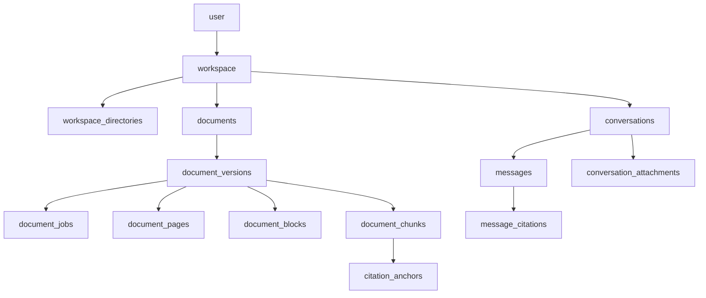
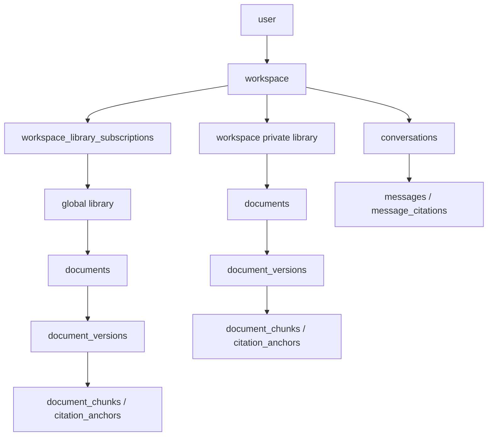

# 全局资料库能力系统分析

版本：v0.1  
日期：2026-03-30

> 文档角色说明：
>
> - 本文基于当前仓库实现，分析“全局资料库”能力的产品与技术设计。
> - 本文是方案分析，不代表已进入当前实施主线。
> - 当前实现约束仍以 [knowledge-assistant-technical-design-nodejs.md](./knowledge-assistant-technical-design-nodejs.md) 和 [implementation-tracker.md](./implementation-tracker.md) 为准。

## 1. 背景与结论

当前系统的资料库边界是 `workspace`。文档、目录、检索索引、引用锚点、阅读器访问和 Agent 工具检索，基本都以 `workspaceId` 作为硬隔离键。  
因此，“管理员维护若干全局资料库，工作空间按需订阅并参与对话召回”不是一个只加一张订阅表的小改动，而是一项会同时影响以下层面的跨层能力：

- 产品信息架构
- 资源授权模型
- 数据模型与 migration
- Qdrant payload 与检索过滤
- Agent tool 契约
- 文档阅读与 citation 跳转
- 资料库管理 UI

本文的核心结论：

1. 不建议把“全局资料库”做成订阅时复制文档到 workspace 的长期方案。
2. 推荐把“资料库”提升为一等对象，`workspace` 改为“拥有一个私有资料库 + 可订阅多个全局资料库”。
3. 对话检索层继续保留 `search_workspace_knowledge` 这一工具名，但它的语义升级为“检索当前 workspace 可访问的资料范围”，默认包含：
   - 当前 workspace 的私有资料库
   - 当前 workspace 已启用的全局资料库订阅
4. 由于当前 tracker 仍处于 `P0 对话链路收口优先`，这项能力更适合先完成设计与数据准备，不建议直接插入主线实现。

## 2. 当前项目中的资料库是怎么设计的

### 2.1 当前边界模型

当前实现里，`workspace` 同时承担：

- 资料的所有权边界
- 会话上下文边界
- 报告边界
- 检索过滤边界

当前核心关系可以概括为：

当前数据模型中的几个关键事实：

- `documents.workspace_id` 是文档归属键。
- `workspace_directories.workspace_id` 是目录树归属键。
- `document_chunks.workspace_id` 和 `citation_anchors.workspace_id` 继续沿用 workspace 作为索引与引用归属键。
- `retrieval_runs.workspace_id`、`tool_runs.workspace_id` 也都以 workspace 为统计和回放边界。

这意味着当前“资料库”本质上不是一个独立资源，而是“挂在工作空间下面的一组目录和文档”。

### 2.2 当前上传与消化链路

工作空间资料上传当前走统一链路：

1. Web 端创建 `documents` / `document_versions`
2. 入队 `parse -> chunk -> embed -> index`
3. Worker 写入：
   - `document_pages`
   - `document_blocks`
   - `document_chunks`
   - `citation_anchors`
4. 再写入 Qdrant

当前几个对“全局资料库”很重要的实现事实：

- 对象存储已经是 content-addressed blob（`blobs/<sha256>`），对象层没有 workspace 前缀。
- `parse_artifacts` 已按 `sha256` 做缓存复用。
- 但 `document_chunks` 和 Qdrant point 仍按 workspace 组织，不是按“共享资料库”组织。

结论：

- 对象和解析缓存已经具备“单份内容复用”的基础。
- 检索索引和业务授权层还没有“共享资料库”这一层。

### 2.3 当前检索与 Agent 设计

当前对话检索的主工具是 `search_workspace_knowledge`。

它的现状是：

- 输入显式要求 `workspace_id`
- Qdrant payload 包含 `workspace_id`
- 搜索过滤时强制 `workspace_id = 当前 workspace`
- Agent system prompt 也明确要求使用当前 `workspace_id`

这带来的结果是：

- 对话召回只会命中当前 workspace 自己的资料
- 不存在“共享资料库并入当前 workspace 检索范围”的入口
- 若强行支持全局资料库，要么复制索引到每个 workspace，要么改检索域模型

### 2.4 当前阅读器与 citation 设计

当前文档阅读和引用跳转也默认文档归属等于当前 workspace：

- 文档详情页按 `documents.id + documents.workspace_id = 当前 workspaceId` 查询
- 文档内容下载 API 也是同样的授权方式
- 聊天引用卡片跳转到 `/workspaces/[workspaceId]/documents/[documentId]?anchorId=...`
- `message_citations` 当前只持久化文档、版本、路径、页码、引用文本，不额外表达“该文档来自哪个共享资料库”

结论：

- 全局资料库不只影响检索，还会影响 citation 可点击性和阅读器授权。

## 3. 为什么这不是“加一张订阅表”就能完成

如果只新增：

- `global_libraries`
- `workspace_library_subscriptions`

但不改现有文档与检索模型，会立刻遇到下面的问题：

1. 文档属于谁  
   当前 `documents` 只能属于一个 `workspace`，不能属于一个共享资料库。

2. 检索怎么召回  
   当前 Qdrant 只按 `workspace_id` 过滤，没法按“当前 workspace 可访问的多个 library_id”过滤。

3. 引用怎么跳转  
   当前阅读器路由和授权都假设文档属于当前 workspace。

4. 资料库目录怎么展示  
   当前目录树是 `workspace_directories`，没有“共享挂载点”。

5. 更新如何传播  
   如果管理员更新了全局资料库中的一个文档，订阅 workspace 是实时看到、延迟同步，还是复制一份自己的快照？

6. 取消订阅后历史对话怎么办  
   历史引用是否还能打开？是否只保留静态摘录？当前没有这层策略。

## 4. 产品目标与非目标

## 4.1 目标

引入“全局资料库”后，系统应满足：

- 管理员可维护多个全局资料库
- 工作空间可自助订阅全局资料库
- 已订阅资料库能直接出现在 workspace 的资料视图中
- 对话检索可从“私有资料 + 已订阅全局资料”一起召回
- 回答 citation 能明确区分来源
- 阅读器跳转仍然可用
- 管理员更新全局资料后，订阅方无需手工重新导入

## 4.2 非目标

第一版不建议同时引入：

- 团队级复杂 ACL
- 每个全局资料库独立管理员列表
- 订阅审批流
- workspace 对全局资料的本地编辑覆盖层
- 历史引用的永久保留授权
- 多 workspace 联合写入同一个共享资料库

## 5. 推荐的产品模型

## 5.1 一等对象与角色

建议把“资料库”抽成一等对象：

- `Private Library`
  - 每个 workspace 自带一个私有资料库
  - 当前资料库行为基本保持不变
- `Global Library`
  - 由管理员维护
  - 可被多个 workspace 订阅
- `Subscription`
  - 表示某个 workspace 已挂载某个 global library
  - 决定是否参与检索、是否在 UI 中可见

角色建议：

- `Super Admin`
  - 第一版直接复用现有 `SUPER_ADMIN_USERNAMES`
  - 负责创建、上传、整理、归档全局资料库
- `Workspace Owner`
  - 继续是 workspace 的唯一拥有者
  - 可管理私有资料
  - 可订阅/取消订阅全局资料库

## 5.2 用户可见的信息架构

工作空间中的资料库建议分成两类来源：

- 我的资料
- 已订阅资料库

推荐的 UI 呈现方式是：

- 私有资料仍放在当前 `资料库` 根下
- 全局资料库以只读挂载方式出现在一个系统分区下，例如：
  - `资料库/订阅/人事制度库/...`
  - `资料库/订阅/产品规范库/...`

这样做有几个好处：

- 避免与用户私有目录冲突
- 路径稳定，不依赖每个 workspace 自定义别名
- citation 展示路径可以跨 workspace 保持一致

## 5.3 第一版建议的产品规则

第一版建议做以下取舍：

1. 订阅是“实时共享”，不是“导入副本”
2. 订阅库默认参与对话检索
3. 检索排序保持“私有资料优先，全局资料补充”
4. 已订阅全局资料在 workspace 中只读
5. workspace 侧不允许移动、重命名、删除全局资料
6. 全局资料 citation 需要显示来源 badge，例如：
   - `工作空间资料`
   - `全局资料库 · 人事制度库`
7. 公开分享页继续不开放内部资料跳转

## 5.4 生命周期建议

### 全局资料库

- 草稿
- 可订阅
- 已归档

### 订阅

- active
- paused
- revoked

其中：

- `paused` 表示暂不参与检索，也不在默认资料视图中显示
- `revoked` 表示取消订阅

## 6. 技术方案比较

## 6.1 方案 A：订阅时物化复制到 workspace

做法：

- 管理员维护一份全局资料库
- workspace 订阅时，把文档、版本、chunk、anchor 甚至索引点复制到 workspace

优点：

- 兼容当前 `workspaceId` 作为硬边界的实现
- 阅读器、引用、资料管理 UI 改动相对小

问题：

- 每个订阅 workspace 都要复制一套检索索引，成本线性放大
- 管理员改一份文档后，需要向所有订阅 workspace 扇出同步
- 取消订阅时要删除对应副本和索引
- 引用 ID、版本和同步状态会变复杂
- 长期看会把“共享”做成“伪共享”

结论：

- 可以作为非常短期的试验方案
- 不建议作为正式架构

## 6.2 方案 B：资料库一等化 + workspace 挂载订阅

做法：

- 文档属于 `library`
- workspace 自带一个私有 `library`
- workspace 可订阅多个全局 `library`
- 检索按“当前 workspace 可访问的 library 集合”过滤

优点：

- 单份文档、单份 chunk、单份 anchor、单份索引
- 全局资料更新天然实时传播
- 数据归属更清晰
- 长期更容易支持 library 级统计、权限、运营和缓存

问题：

- 会改动 schema、检索、授权、阅读器和 UI
- 迁移跨度比方案 A 大

结论：

- 推荐作为正式方案

## 6.3 方案 C：混合方案

做法：

- 底层采用方案 B
- 产品上提供“订阅共享”和“导入快照”两种模式

结论：

- 长期可以考虑
- 第一版不建议同时做两套模式

## 7. 推荐技术设计

## 7.1 总体模型

推荐把模型调整为：

本质变化是：

- `workspace` 不再直接等于“资料库”
- `workspace` 改成“一个私有资料库的所有者 + 若干全局资料库订阅者”

## 7.2 数据模型建议

建议新增：

### `knowledge_libraries`

建议字段：

- `id`
- `library_type`
  - `workspace_private`
  - `global_managed`
- `workspace_id`
  - 私有资料库时非空
  - 全局资料库时为空
- `slug`
- `title`
- `description`
- `status`
  - `draft`
  - `active`
  - `archived`
- `managed_by_user_id`
- `created_at`
- `updated_at`
- `archived_at`

### `workspace_library_subscriptions`

建议字段：

- `id`
- `workspace_id`
- `library_id`
- `status`
  - `active`
  - `paused`
  - `revoked`
- `search_enabled`
- `created_by_user_id`
- `created_at`
- `updated_at`
- `revoked_at`

约束建议：

- `(workspace_id, library_id)` 唯一
- 只能订阅 `global_managed` 且 `active` 的 library

### `library_directories`

建议以 `library_id` 取代 `workspace_directories.workspace_id`。

如果想降低迁移风险，可以分两步：

1. 先新增 `library_directories`
2. 再把现有 `workspace_directories` 迁移过去

## 7.3 对现有表的改造建议

建议新增 `library_id` 并逐步替代 `workspace_id` 的表：

- `documents`
- `document_chunks`
- `citation_anchors`

建议保留 `workspace_id` 的表：

- `conversations`
- `conversation_attachments`
- `reports`
- `tool_runs`
- `model_runs`

原因：

- 这些对象天然仍然属于 workspace 上下文
- 会话级临时附件本质上是 conversation-scoped parse-only 资料，不应并入全局资料库模型

### 需要特别注意的表

#### `documents`

建议调整为：

- `library_id` 成为文档归属主键
- 唯一索引从 `(workspace_id, logical_path)` 改为 `(library_id, logical_path)`

#### `document_chunks`

建议：

- 检索归属改成 `library_id`
- 这样一个 global library 只需要一份 chunk 和一份 Qdrant point

#### `citation_anchors`

建议：

- 归属改成 `library_id`
- 便于按 library 做权限判断和索引清理

#### `message_citations`

建议新增：

- `library_id`
- `source_scope`
  - `workspace_private`
  - `global_library`
- 可选 `library_title_snapshot`

原因：

- 当前 `message_citations` 无法直接表达来源资料库
- 全局资料库场景下，前端需要展示来源 badge

## 7.4 索引与检索改造建议

### Qdrant payload

建议新增或替换为：

- `library_id`
- `library_type`
- 继续保留：
  - `document_id`
  - `document_version_id`
  - `anchor_id`
  - `document_path`
  - `directory_prefixes`
  - `doc_type`
  - `tag_values`

迁移期间可临时双写：

- `workspace_id`
- `library_id`

等所有读路径切换后，再考虑是否移除 `workspace_id`。

### 检索作用域解析

建议新增一个纯函数模块，例如：

- `resolveWorkspaceKnowledgeScope(workspaceId)`

输出：

- `privateLibraryId`
- `subscribedLibraryIds`
- `searchableLibraryIds`

`search_workspace_knowledge` 内部流程改为：

1. 解析当前 workspace 的可访问 library scope
2. 用 `library_id in searchableLibraryIds` 过滤 Qdrant
3. 在结果中补充：
   - `library_id`
   - `library_title`
   - `source_scope`

### 排序建议

默认排序可保持：

- workspace 私有资料轻微加权
- 全局资料作为补充召回

原因：

- 用户在 workspace 中提问时，通常更希望当前空间资料优先

这可以在 rerank 前后增加一个小幅 source boost，而不改变工具契约。

### 检索观测建议

`retrieval_runs` 当前只记录 `workspace_id`。  
如果引入全局资料库，建议额外记录本次实际搜索范围，例如：

- `searched_library_ids_json`
- 或写入 `raw_queries_json.scope`

原因：

- 便于排查“为什么某个全局资料库没有被召回”
- 便于后续做 library 级使用统计

## 7.5 Agent / Tool 契约建议

推荐保留现有工具名：

- `search_workspace_knowledge`

不要在第一版直接改成：

- `search_accessible_libraries`

原因：

- 当前 agent runtime、tool timeline、测试和 system prompt 都围绕现有工具名
- 改语义比改工具名更稳

推荐升级后的语义：

- 输入仍是 `workspace_id`
- 含义变成“检索当前 workspace 可访问的知识范围”

推荐新增返回字段：

- `library_id`
- `library_title`
- `source_scope`

这样前端和 grounded answer 层可以区分：

- 私有资料
- 全局资料库

## 7.6 授权与阅读器改造建议

需要新增一套“workspace 可访问文档/anchor”判定，而不再只看：

- `document.workspaceId === workspaceId`

建议新增 helper：

- `requireWorkspaceAccessibleDocument(workspaceId, documentId, userId)`
- `requireWorkspaceAccessibleAnchor(workspaceId, anchorId, userId)`

访问条件改为：

1. 用户拥有当前 workspace
2. 文档属于：
   - 该 workspace 的私有 library，或
   - 该 workspace 的有效全局资料库订阅

这样可以保留现有路由形态：

- `/workspaces/[workspaceId]/documents/[documentId]`

但内部授权从“文档属于该 workspace”升级成“文档对该 workspace 可访问”。

## 7.7 资料库管理 UI 建议

### 管理员侧

建议新增：

- `/settings/global-libraries`

功能：

- 创建全局资料库
- 编辑标题/描述
- 上传资料
- 管理目录
- 归档/恢复
- 查看订阅 workspace 数量

第一版可以直接复用：

- 现有资料上传
- 现有目录管理
- 现有文档处理状态

区别只是归属从 workspace 改成 global library。

### workspace 侧

建议新增：

- “添加资料库”入口
- 订阅列表
- 已订阅资料库状态切换

workspace 内展示建议：

- 私有资料区可编辑
- 已订阅资料库区只读

read-only 行为需要覆盖：

- 禁止重命名
- 禁止移动
- 禁止删除
- 禁止在订阅目录下上传

## 7.8 对话与 citation 体验建议

回答中的引用建议补一个来源标签：

- `工作空间资料`
- `全局资料库 · <library title>`

阅读器跳转建议保持不变：

- 仍然从当前 workspace 进入文档页

但需要保证：

- 如果该 workspace 已取消订阅，则链接点击后要有明确失败语义
- 历史聊天中的静态 citation 文本仍然可见

第一版推荐：

- 保留静态 citation 卡片
- 取消订阅后不保证历史引用仍可打开

这是最小实现；如果后续要支持“历史证据永久可回看”，需要再引入额外的历史访问策略。

## 8. 落地顺序建议

考虑当前 tracker 仍是 `P0 对话链路收口优先`，建议按下面顺序推进，而不是直接全量开工：

### Phase 0：设计与数据预埋

- 明确 library 一等化模型
- 设计 migration
- 设计检索 scope 解析模块

### Phase 1：底层模型改造

- 新增 `knowledge_libraries`
- 新增 `workspace_library_subscriptions`
- 为每个现有 workspace 回填一个 private library
- 为 `documents` / `document_chunks` / `citation_anchors` 回填 `library_id`

### Phase 2：检索与授权切换

- Qdrant payload 加 `library_id`
- 重建或增量回填索引
- 切换 `search_workspace_knowledge`
- 切换文档与 anchor 访问授权 helper

### Phase 3：管理员全局资料库管理

- 全局资料库 CRUD
- 上传和目录管理
- 归档与状态控制

### Phase 4：workspace 订阅与 UI

- 订阅入口
- 资料树挂载
- 只读行为
- citation 来源展示

## 9. migration 与兼容性建议

这是一个跨层改造，建议使用 `expand -> migrate -> contract`：

### expand

- 新表、新列、新索引先加上
- 代码先双读或双写

### migrate

- 回填每个 workspace 的 private library
- 回填文档、chunk、anchor 的 `library_id`
- 重建 Qdrant payload

### contract

- 逐步移除基于 `workspace_id` 的旧读取路径

不要一次性直接把所有 `workspace_id` 删掉。  
当前项目仍在主会话链路收口阶段，应该优先保留可回滚、可观察的迁移路径。

## 10. 测试建议

这项能力至少应补这些测试：

### 纯逻辑测试

- `workspace` 可访问的 library scope 解析
- 私有资料优先于全局资料的排序加权
- 订阅只读路径的操作拦截

### 数据与授权测试

- workspace 只能访问自己私有 library
- workspace 可访问已订阅 global library
- workspace 不能访问未订阅 global library
- 取消订阅后文档页与内容 API 返回明确失败

### 检索测试

- `search_workspace_knowledge` 能召回私有 + 已订阅全局资料
- 未订阅的 global library 不应被召回
- 返回结果能标记 `source_scope`

### UI 测试

- 订阅后的资料树挂载显示正确
- 全局资料在 workspace 中只读
- citation 卡片能显示来源标签

### 回归测试

- 不伪造 citation
- 会话级临时附件检索行为不被这次改造破坏
- 公开分享页仍不提供内部资料跳转

## 11. 主要风险

### 11.1 当前主链路优先级冲突

这是当前最大的产品风险。  
全局资料库是正确方向，但它不是当前 tracker 定义的最优先主线。

### 11.2 schema 与检索边界同时变更

这次改造会同时影响：

- Postgres schema
- Worker ingest
- Qdrant payload
- Agent tool
- Web 授权

如果分层不清，很容易造成“索引能搜到但前端打不开”或“文档能看但工具搜不到”的断层。

### 11.3 历史 citation 行为

取消订阅后历史引用是否仍应可跳转，是产品上必须明确的策略点。

### 11.4 全局资料的路径稳定性

如果允许 workspace 自定义挂载别名，会显著增加 citation path、阅读器 breadcrumb 和检索结果展示复杂度。

第一版建议不要支持自定义挂载别名。

### 11.5 管理员模型过于粗粒度

第一版复用 `SUPER_ADMIN_USERNAMES` 很 pragmatic，但它是 env-only、平台级权限，不适合长期承载精细化资料运营。

## 12. 待明确的产品问题

以下问题最好在正式开工前拍板：

1. workspace 侧是否允许下载全局资料库文件  
   建议第一版默认允许在线阅读，但下载能力可按 library 配置控制。

2. 取消订阅后，历史 citation 是否仍应可点击  
   建议第一版先不承诺历史跳转持续可用，只保留静态 citation 文本。

3. 是否允许“只展示不检索”  
   建议保留 `search_enabled`，允许某个订阅库挂载在资料树里但不参与默认召回。

4. 是否需要 workspace 对全局文档打本地标签/备注  
   第一版建议不做；若未来需要，应通过 overlay 表实现，而不是直接改共享文档元数据。

5. 是否需要 library 级订阅上限或配额  
   如果后续一个 workspace 可能订阅很多资料库，需要提前评估检索过滤和 UI 规模。

## 13. 建议的第一版边界

如果这项能力要进入后续 roadmap，建议第一版只做：

- 全局资料库一等化
- workspace 订阅
- 对话检索可召回订阅资料
- citation 来源标记
- 文档阅读可访问
- workspace 侧只读挂载

先不做：

- 导入快照
- 自定义挂载别名
- 历史 citation 永久保留授权
- library 级细粒度管理员
- workspace 对全局文档的本地覆盖元数据

## 14. 最终建议

“全局资料库”能力是值得做的，但不应以“继续把 workspace 当唯一资料库边界”为前提硬补。

推荐方向是：

1. 把 `library` 提升为一等对象
2. 让 `workspace` 拥有一个私有 library，并可订阅多个 global library
3. 让 `search_workspace_knowledge` 的语义升级为“检索当前 workspace 可访问范围”
4. 让阅读器和 citation 的授权也切到“workspace 是否有访问该 library 的资格”

如果只是为了快速上线而采用“订阅即复制”的做法，短期会快，但后续会在同步、索引放大、引用一致性和取消订阅行为上付出更高成本。  
从当前代码基线看，正式方案更适合一次性把资料库边界从 `workspace` 提升到 `library`，再以 migration 的方式平滑切换。
