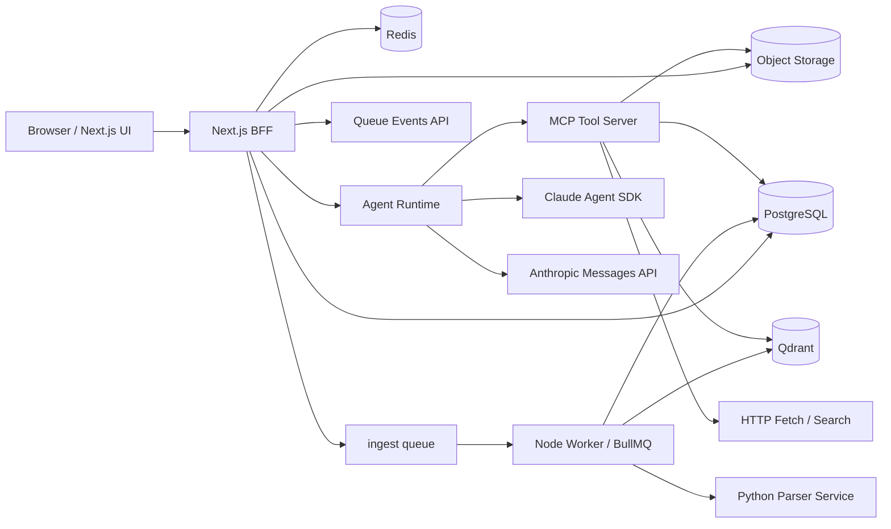

# 通用知识库 Agent 助手技术设计（Node.js / Next.js / Claude Agent SDK）

版本：v0.6
日期：2026-03-29

> 文档角色说明：
>
> - 本文件是当前实现的架构/技术约束主文档。
> - 当前阶段进度、活跃待办和下一步顺序请看 [implementation-tracker.md](/Users/fan/project/tmp/law-doc/docs/implementation-tracker.md)。
> - 本地开发启动、Docker 依赖和日常操作请看 [development-setup.md](/Users/fan/project/tmp/law-doc/docs/development-setup.md)。
> - 若与其他支持性文档冲突，以本文件为准。

## 1. 已确认约束

- 产品定位是“通用工作空间知识库助手”，不是法律垂类产品。
- 仍保留一个专项的“法律条文搜索”工具，用于需要法规引用的任务。
- 主站和主后端使用 Node.js。
- Web 框架使用 Next.js。
- 文档解析允许使用 Python。
- Agent 决策与规划固定使用 `@anthropic-ai/claude-agent-sdk`。

第一版产品核心：

- 单用户账号体系
- 账号注册开关由 `system_settings` 控制
- 工作空间级知识库
- 工作空间级会话与报告
- 会话级公开只读分享链接
- 支持按目录组织资料
- 上传后异步消化
- 基于 MD5/SHA256 的解析缓存
- 基于资料库的带引用问答
- 可选联网补充搜索

## 2. 技术栈

- Web + BFF：`Next.js 16 App Router`
- 认证：`Auth.js`
- 数据库：`PostgreSQL`
- ORM：`Drizzle ORM`
- 队列与缓存：`Redis + BullMQ`
- 对象存储：`S3 Compatible`（开发期可用 MinIO）
- 向量检索：`Qdrant`
- Agent 规划：`@anthropic-ai/claude-agent-sdk`
- 最终答案结构化输出：`@anthropic-ai/sdk`
- 文档解析：`Python + FastAPI`
- PDF 阅读：`PDF.js`

当前 provider 策略：

- Agent 规划固定 Anthropic
- embedding / rerank 优先 DashScope，未配置时回退本地方案
- OCR 默认关闭，只有扫描件、图片型 PDF 或无文本层材料才启用
- OCR provider 暂不推进本地实现；后续待商业 API 口径确认后再接入，候选方向优先考虑百炼

## 3. 总体架构



架构原则：

- Next.js 负责 UI 与轻量 BFF，不直接做重计算。
- 长耗时任务都走 BullMQ Worker。
- Agent Runtime 独立成常驻 Node 进程。
- 文档解析放到 Python Parser Service。
- 检索证据和最终生成分层，避免把所有责任压给 Agent SDK。

当前实现快照：

- `Next.js BFF` 已经承接注册登录、工作空间、上传签名、文档管理、会话消息落库、报告基础操作和文档阅读页。
- `Next.js BFF` 已补齐会话分享管理，可为单个会话生成 bearer-style 公开链接，并提供匿名只读分享页。
- 工作空间当前不再提供归档入口；删除改为软删除，已删除空间会从默认列表和资源访问链路中隐藏。
- `BullMQ Worker` 已经跑通 `parse -> chunk -> embed -> index` 流程，解析产物会同时落 PostgreSQL 与 Qdrant。
- `Agent Runtime` 已经能协调工作空间检索、联网检索与工具调用证据回收，再交给最终 grounded answer renderer。
- 回答策略当前固定为“工作空间资料优先 + 联网补充检索”，不再提供 `kb_only / kb_plus_web` 模式分支。
- `conversation.respond` 队列已接入 `Agent Runtime` Worker；用户发消息后会先落 user message + assistant placeholder，再异步执行 Claude Agent SDK。
- `Agent Runtime` 现在会抽取 Claude Agent SDK 的 assistant text delta，并把 assistant draft 持久化回 `messages`，供前端会话气泡实时更新。
- 当本地缺少 `ANTHROPIC_API_KEY` 时，`Agent Runtime` 会回退到 mock tool + mock assistant chunk，保证主会话链路、SSE 和 UI 可以本地演示与联调。
- Agent 工具调用事件现在会以 `messages.role = "tool"` 持久化到数据库，并由 `/api/conversations/[conversationId]/stream` 作为 SSE 工具时间线持续推送到前端；同一路 SSE 也会推送 assistant `answer_delta` / `answer_done` / `run_failed`。
- `Python Parser Service` 已支持 PDF / DOCX / text 基础解析、结构块构建、无文本 PDF 的 OCR 降级入口。
- 首条消息前可先上传“会话级临时资料”；这条链路会走 `parse/chunk/citation anchor`，但明确跳过 embedding 和 Qdrant indexing。
- 会话级临时资料会落到 `conversation_attachments`，回答阶段可通过独立 MCP tool 检索，并继续复用 `citation_anchors -> message_citations -> 阅读页跳转` 链路。
- 文本类临时资料现在会额外保留 line / block locator，前端引用标签和阅读页可显示行号或段号。

当前已知缺口：

- 当前回答流式是“数据库轮询 + assistant draft 持久化”链路，不是 provider 直连 token transport；最终 grounded answer、structured state 和 citations 仍在完成态统一落库。
- `search_web_general`、`search_statutes`、`create_report_outline`、`write_report_section` 仍包含明显占位实现，需要后续替换为真实 provider 或真实生成流程。
- OCR 真实 provider 尚未接入；当前仅支持关闭或 mock，并继续保持 disabled 直到商业 API 方案确定。
- retrieval 已补上 dense 候选窗口内的 BM25 混合打分，但仍未完成更完整的 sparse 候选扩展。
- 前端与文案仍存在少量去法律化未收口残留。
- 会话级临时资料当前只做 parse-only 本地检索，不进入工作空间全局检索，也还没有后台清理任务。

## 4. 运行时分层

### 4.1 运行时与升级约束

当前版本演进采用双轨升级模型：

- 数据库结构变更：Drizzle versioned SQL migrations
- 非 SQL 一次性升级：app upgrades

约束：

- `packages/db/src/schema.ts` 是 schema source of truth。
- `packages/db/drizzle/**` 必须提交到仓库，作为可审计 migration 历史。
- app upgrades 通过 `app_upgrades` 表记录执行状态。
- 开发启动前执行 safe blocking upgrades。
- 生产发布时先执行 dedicated upgrade step，再启动运行时服务。
- 运行时服务启动前只做 `pnpm app:upgrade:check`，若仍有 blocking pending upgrades 则 fail-fast。
- schema 变更应遵守 `expand -> migrate -> contract`，避免多进程部署期间直接破坏兼容性。

### 4.2 单机 Docker 生产部署

生产部署目标为单机 Docker 多容器。

- Node 侧服务复用根目录 `Dockerfile`
- Parser 使用独立 Python 镜像
- Web 采用 Next.js `output: "standalone"`
- `upgrade` 容器负责执行 SQL migrations + blocking app upgrades + bucket ensure

### 4.3 健康检查

生产编排中的健康检查约定：

- web: `/api/health`
- worker: `/health`
- agent-runtime: `/health`
- parser: `/health`


负责：

- 多步任务规划和工具调用
- 管理会话 session
- 管理工具调用与 grounded answer 校验链路
- 组织问答、研究和写作流程
- 在工具结果与最终答案之间插入 grounded final answer 校验层

### 4.4 Python Parser Service

负责：

- 文本抽取
- OCR 降级入口
- 表格和版面结构恢复
- 页码与坐标映射

## 5. 代码组织

```text
.
├─ apps/
│  ├─ web/
│  ├─ worker/
│  └─ agent-runtime/
├─ services/
│  └─ parser/
├─ packages/
│  ├─ db/
│  ├─ contracts/
│  ├─ queue/
│  ├─ storage/
│  ├─ retrieval/
│  ├─ agent-tools/
│  └─ auth/
└─ docs/
```

## 6. 数据与检索

核心对象：

- `users`
- `workspaces`
- `documents`
- `document_versions`
- `document_jobs`
- `document_pages`
- `document_blocks`
- `document_chunks`
- `citation_anchors`
- `conversations`
- `conversation_attachments`
- `messages`
- `message_citations`
- `conversation_shares`
- `reports`
- `report_sections`
- `retrieval_runs`
- `retrieval_results`

文档类型采用通用 taxonomy：

- `reference`
- `guide`
- `policy`
- `spec`
- `report`
- `note`
- `email`
- `meeting_note`
- `other`

检索原则：

- 工作空间是最小隔离边界。
- 目录树只影响过滤和展示，不改变底层 chunk 平铺索引。
- 回答引用落到 `citation_anchors`。

## 7. Tool 设计

当前工具集合：

- `search_workspace_knowledge`
- `search_conversation_attachments`
- `read_citation_anchor`
- `search_web_general`
- `fetch_source`
- `create_report_outline`
- `write_report_section`
- `search_statutes`

说明：

- `search_statutes` 是保留的专项工具，用于法律条文或法规引用场景。
- 其他工具和主流程都以通用知识库助手为中心组织。

## 8. 当前阶段关注点

优先级统一以 [implementation-tracker.md](/Users/fan/project/tmp/law-doc/docs/implementation-tracker.md) 为准。当前重点仍然是：

1. 基于已打通的主会话链路，继续稳住回答完成态和前端收尾体验
2. grounded answer 与证据展示 / citation 联动
3. retrieval 深化
4. 工具占位实现替换与研究/写作链路增强
5. OCR 商业 API provider 方案确认后的接入
