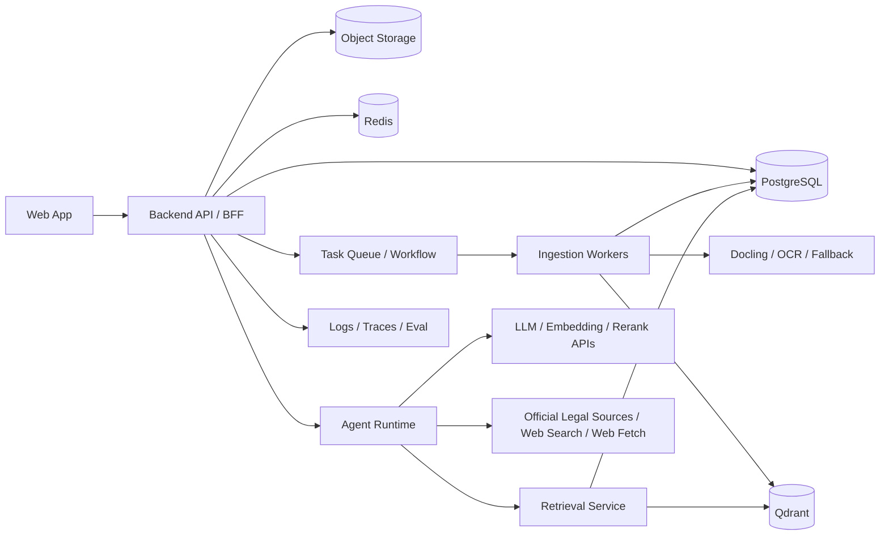

# 律师行业 AI 助手技术方案

> 文档角色说明：
>
> - 本文件是历史调研/通用备选方案文档，不是当前实现方案。
> - 其中出现的 `FastAPI / Celery / backend-api` 等服务划分，属于早期备选架构，不代表当前代码实现。
> - 当前实施请优先参考 [legal-ai-assistant-technical-design-nodejs.md](/Users/fan/project/tmp/law-doc/docs/legal-ai-assistant-technical-design-nodejs.md)。
> - 当前阶段进度与执行顺序请参考 [implementation-tracker.md](/Users/fan/project/tmp/law-doc/docs/implementation-tracker.md)。

版本：v0.1  
日期：2026-03-28

## 1. 结论先行

推荐采用“业务后端主控 + Agent Runtime + 异步文档流水线 + 混合检索”的分层架构。

核心判断：

- 不建议把 Claude Agent SDK 直接作为整个 SaaS 的唯一控制层。
- 建议把账号权限、案卷隔离、审计、计费、任务编排放在自有后端。
- 建议把 Claude Agent SDK 封装在独立 `agent-runtime` 服务里，专注多工具推理与报告编排。
- 检索层必须独立建设，不能把“上传文档直接塞给模型”当成主方案。
- 回答层必须把“证据包”和“最终生成”分开，优先使用可追溯引用。

换句话说：Agent 是能力层，不是业务边界层。

## 2. 外部能力调研结论

基于截至 2026-03-28 的公开官方资料，和本项目直接相关的结论如下：

- Anthropic 的 Agent SDK 已具备会话、MCP、自定义工具、Subagents、权限控制等能力，适合封装成专门的 Agent Runtime。
- Anthropic 在 2025-01-23 发布了 `Citations`，用于让模型根据输入文档自动给出来源引用。
- Anthropic 在 2025-07-03 发布了 `search_result` 内容块，适合自建 RAG 场景，让自定义检索工具返回结果并自动生成自然引用。
- Anthropic 的 `web search` 工具已可直接用于最新信息查询；`web fetch` 可抓取网页和 PDF，但截至 2026-03-28 文档仍标注为 beta，且官方明确提醒存在数据外泄风险，需要域名白名单。
- Qdrant 官方已明确支持 dense+sparse hybrid search、payload filter、多阶段查询与 reranking，适合做法律知识库检索底座。
- Docling 官方支持 PDF、DOCX、图片等格式，具备版面、阅读顺序、表格结构和 OCR 能力；Unstructured 仍适合作为兼容性 fallback；针对中文扫描件，可以增加 PaddleOCR/PP-Structure 作为 OCR 兜底。

这些能力足以支撑你的 MVP 到 Beta 架构，不需要一开始自研 Agent 框架。

## 3. 推荐技术栈

### 3.1 Web

- `Next.js + React + TypeScript`
- `Tailwind CSS`
- `PDF.js` 或同类阅读组件，用于页码、选区、高亮和锚点跳转
- `SSE` 优先用于对话流式输出；任务状态可用 `WebSocket` 或 `SSE`

### 3.2 Backend

- `FastAPI + Pydantic + SQLAlchemy`
- `PostgreSQL` 存业务数据
- `Redis` 做缓存、任务状态和短期队列缓冲
- 异步工作流：
  - MVP：`Celery + Redis`
  - 生产增强：`Temporal`

### 3.3 AI / Retrieval

- Agent/主回答模型：`Claude Sonnet 4.x/4.6` 级别
- 轻任务模型：更便宜的小模型，用于路由、标签抽取、元数据清洗
- Embedding：选择中文和法律文本表现稳定的多语 embedding 服务
- Rerank：优先支持中文/多语的 reranker
- 向量库：`Qdrant`
- 对象存储：`S3` 兼容存储（AWS S3 / MinIO / OSS）

### 3.4 文档处理

- 主解析器：`Docling`
- 兼容 fallback：`Unstructured`
- 中文 OCR fallback：`PaddleOCR / PP-Structure`
- 导出：`python-docx` 或模板化导出服务

## 4. 为什么不是“纯 Claude Agent SDK 架构”

如果把 Claude Agent SDK 直接当成主业务后端，会有四个问题：

- 账号权限、租户隔离、案卷边界、计费配额等业务规则不应由 Agent 会话来承担。
- 文档入库、重试、状态流转、失败补偿属于 durable workflow，更适合任务系统。
- 法律场景要求强审计和可回放，必须保留独立的检索日志、引用日志、工具日志。
- 你后续大概率会混用多个模型与外部服务，单一 SDK 不适合作为唯一抽象层。

因此推荐的组织方式是：

- `backend-api`：对外唯一入口，负责鉴权、RBAC、案卷隔离、任务创建、配额、审计。
- `ingestion-pipeline`：负责文档消化。
- `retrieval-service`：负责查询改写、混合检索、重排、证据组装。
- `agent-runtime`：基于 Claude Agent SDK，负责多工具决策、报告写作、联网研究。

## 5. 总体架构



## 6. 服务划分

### 6.1 Backend API

职责：

- 登录注册、组织与成员管理
- 案卷与知识库管理
- 上传签名、文档元数据写入
- 创建异步任务
- 对话会话管理
- 成本配额、审计日志、管理员后台

不做：

- 不直接执行重 OCR、重解析、重写报告
- 不直接拼接复杂 RAG 流程

### 6.2 Ingestion Pipeline

职责：

- 读取对象存储中的原始文件
- 文件指纹、去重、格式探测
- OCR、版面解析、结构恢复
- 生成页面、块、段落、表格、标题层级
- 切块、向量化、索引入库
- 输出质量评分与失败原因

### 6.3 Retrieval Service

职责：

- 查询意图识别
- 查询改写和拆解
- dense+sparse 混合检索
- 精确字段加权，例如法条编号、合同条款号、文档标题
- 重排
- 证据包组装
- 统一返回可引用的 `search_result` 结构

### 6.4 Agent Runtime

职责：

- 基于 Claude Agent SDK 执行多工具循环
- 决定是否调用私有检索、联网搜索、网页抓取、报告生成
- 控制工具权限和工具选择范围
- 产出最终回答或报告片段

建议：

- Agent Runtime 只接收已经鉴权的、带案卷上下文的内部请求
- 不直接暴露给浏览器
- 按案卷和会话绑定 session id

## 7. 文档入库流水线

推荐流水线：

1. 用户上传文件到对象存储。
2. API 写入 `documents` 和 `ingest_jobs`。
3. Worker 拉取任务，做文件类型识别、哈希、病毒扫描。
4. 若为 PDF/图片，先判断是否需要 OCR。
5. 使用 Docling 做结构化解析，拿到页面、文本块、标题层级、表格、阅读顺序。
6. 若解析质量低或格式不支持，回退到 Unstructured 或 OCR 专项管线。
7. 生成块级标准结构：
   - `page_no`
   - `block_type`
   - `text`
   - `bbox`
   - `heading_path`
   - `section_id`
   - `table_html` 或 `table_text`
8. 执行法律文档专用切块。
9. 生成 dense 向量与 sparse 特征。
10. Upsert 到 Qdrant，并把块级和块到页的映射写入 PostgreSQL。
11. 更新任务状态为 `ready` 或 `failed`。

### 7.1 法律文档切块策略

不要按固定字数粗暴切块。建议组合以下规则：

- 规则一：按标题层级切。
- 规则二：识别“第 X 条 / 第 X 款 / 5.1 / 5.1.2”等结构编号。
- 规则三：保留父级标题路径，例如“合同 > 违约责任 > 第 8 条”。
- 规则四：表格单独成块，但保留前后上下文摘要。
- 规则五：对长条款允许继续切子块，但每个子块保留原条款编号和父标题。

建议单块字段：

- `chunk_id`
- `document_id`
- `document_version_id`
- `case_id`
- `page_start`
- `page_end`
- `text`
- `plain_text`
- `heading_path`
- `section_label`
- `keywords`
- `bbox_refs`
- `doc_type`
- `tags`
- `parties`
- `effective_date`
- `language`
- `parse_confidence`

### 7.2 质量评分

每个文档入库后生成质量分：

- OCR 覆盖率
- 异常字符比例
- 标题识别完整度
- 页到块映射完整度
- 可引用锚点覆盖率

低于阈值时：

- 不直接标记完全可用
- 给前端显示“需人工校验”
- 允许用户手动修正文档类型或重新解析

## 8. 检索架构

### 8.1 查询路由

先做轻量路由，将问题分成四类：

- `fact_qa`：客观事实问答
- `analysis`：需要结合依据推理
- `drafting`：生成报告或文书
- `research`：需要联网补充

同时识别：

- 是否只允许本地资料
- 是否涉及具体法条、条款号、案由、日期
- 是否需要比较多份文档

### 8.2 检索流程

推荐流程：

1. 生成原始查询、关键词查询、法条/编号精确查询、扩展查询。
2. 按 `organization_id + workspace_id + case_id` 做强过滤。
3. 对 dense 检索取 top 40。
4. 对 sparse/BM25 检索取 top 40。
5. 对标题命中、法条编号命中、标签命中做规则加权。
6. 合并去重。
7. 用 reranker 对 top 20 重排。
8. 输出 top 6 到 top 10 作为证据包。

### 8.3 为什么必须混合检索

法律场景里，下面几类问题仅靠向量检索不够：

- 用户明确给出法条编号或合同条款号
- 同义词少、关键词强的专业术语
- 同一个事实在不同文档里表达差异很大
- 需要同时找“语义相关”与“文字精确”结果

因此必须将 dense 和 sparse 结合，而不是二选一。

### 8.4 引用友好的结果格式

对于 Anthropic 体系，建议 Retrieval Service 直接返回 `search_result` 风格结构，而不是只返回纯文本列表。这样 Agent 在最终回答时可以天然带来源引用。

返回结构建议包含：

```json
{
  "type": "search_result",
  "source": "kb://document/{document_id}#chunk/{chunk_id}",
  "title": "劳动合同（第8条 违约责任）",
  "content": [
    {
      "type": "text",
      "text": "......"
    }
  ],
  "citations": {
    "enabled": true
  }
}
```

同时在业务侧维护 `source` 到真实文档页码和坐标的映射，前端收到 citation 后可跳转到原文高亮。

## 9. 回答与防幻觉设计

### 9.1 证据包和生成分离

建议执行两阶段：

1. Retrieval Service 输出证据包。
2. Agent/LLM 基于证据包生成回答。

不要让模型直接从海量 chunk 中自由检索和总结。

### 9.2 输出格式

建议统一成结构化响应：

- `answer`
- `evidence_summary`
- `reasoning_note`
- `missing_information`
- `confidence`
- `citations`

### 9.3 Grounded 模式

默认启用：

- 无证据不输出肯定结论
- 推理与直接依据分开展示
- 找不到依据时明确拒答或提示补充材料

对长报告再增加一层“引用核验”：

- 检查每个结论段是否关联至少一个引用
- 检查引用是否和该段主张一致
- 不一致时将段落打回重写

## 10. Agent Runtime 设计

### 10.1 推荐定位

Claude Agent SDK 适合放在 `agent-runtime` 服务中，承担：

- 工具选择
- 工具调用循环
- 多步研究
- 报告大纲生成
- 报告分段写作

不适合承担：

- 案卷权限判断
- 主数据库访问控制
- 上传任务状态机
- 计费和审计主逻辑

### 10.2 工具清单

建议首批工具：

- `search_case_knowledge`
- `get_document_block`
- `search_official_legal_sources`
- `web_search`
- `web_fetch`
- `draft_report_outline`
- `write_report_section`
- `export_docx`
- `compare_documents`
- `extract_timeline`

### 10.3 工具调用策略

建议强约束：

- 先尝试 `search_case_knowledge`
- 私有资料不足且用户允许时，才调 `search_official_legal_sources` 或 `web_search`
- `web_fetch` 只允许抓取用户显式提供或搜索结果返回的 URL
- `web_fetch` 配置 `allowed_domains`
- 报告生成必须先出大纲，再写正文

## 11. 关键数据模型

### 11.1 业务表

- `organizations`
- `users`
- `memberships`
- `workspaces`
- `cases`
- `documents`
- `document_versions`
- `ingest_jobs`
- `conversations`
- `messages`
- `message_citations`
- `reports`
- `tool_runs`
- `audit_logs`

### 11.2 解析与检索表

- `document_pages`
- `document_blocks`
- `document_chunks`
- `chunk_entities`
- `chunk_links`
- `retrieval_runs`
- `retrieval_results`
- `eval_runs`

### 11.3 向量载荷字段

Qdrant payload 建议至少包含：

- `organization_id`
- `workspace_id`
- `case_id`
- `document_id`
- `document_version_id`
- `chunk_id`
- `doc_type`
- `tags`
- `page_start`
- `page_end`
- `heading_path`
- `section_label`
- `party_names`
- `effective_date`
- `language`

多租户建议：

- 单集合 + payload 分区
- 检索时强制 payload filter

## 12. API 设计草案

### 12.1 上传与处理

- `POST /api/files/upload-url`
- `POST /api/documents`
- `GET /api/ingest-jobs/{job_id}`
- `POST /api/ingest-jobs/{job_id}/retry`

### 12.2 案卷与检索

- `POST /api/cases`
- `GET /api/cases/{case_id}/documents`
- `POST /api/cases/{case_id}/search`
- `GET /api/documents/{document_id}/anchors/{anchor_id}`

### 12.3 对话与报告

- `POST /api/conversations`
- `POST /api/conversations/{conversation_id}/messages`
- `POST /api/reports`
- `POST /api/reports/{report_id}/sections/{section_id}/generate`
- `POST /api/reports/{report_id}/export`

## 13. 部署与扩展

### 13.1 单租户起步

适合前期客户较少时：

- 单个 PostgreSQL
- 单个 Qdrant 集群
- 单对象存储桶按租户前缀隔离
- 多 Worker 水平扩展

### 13.2 企业化增强

随着客户增长，再加：

- PostgreSQL 读写分离
- Qdrant 分片/副本
- 独立 OCR worker 池
- 独立 report worker 池
- 独立 evaluation worker 池

### 13.3 私有化/VPC

如果目标客户是大所、金融法务、国企法务，建议从第一版就保留以下边界：

- 模型网关可替换
- 对象存储、数据库、向量库均可自托管
- OCR 和解析器可离线运行
- Agent Runtime 不依赖浏览器态本地能力

## 14. 可观测性与评测

上线后必须建立离线评测，不要只看主观体验。

### 14.1 检索指标

- Recall@k
- NDCG@k
- MRR
- Citation Hit Rate
- 过滤命中率

### 14.2 生成指标

- Unsupported Claim Rate
- Citation Precision
- Citation Coverage
- Hallucination Rate
- Human Acceptance Rate

### 14.3 评测数据

建议三层数据集：

- 公开中文法律 benchmark，用于横向感知能力上限
- 律师标注的内部金标集，用于真实业务评测
- 线上匿名回流样本，用于持续回归

公开 benchmark 只用于辅助，不用于替代真实客户数据评测。

## 15. 分阶段落地建议

### Phase 1：MVP

目标：先把“上传-消化-检索-带引用回答”打通。

范围：

- Next.js 前端工作台
- FastAPI 后端
- PostgreSQL + Qdrant + Redis
- Docling 主解析 + OCR fallback
- 混合检索 + rerank
- 案卷问答
- 引用跳转
- 大纲先行的报告生成

### Phase 2：Beta

目标：补齐“现代 Agent”能力，但不牺牲可信度。

范围：

- 联网搜索
- 网页/PDF 抓取
- 多 Agent 协作
- 合同比对
- 时间线与争点树
- 批注与人工修正

### Phase 3：Enterprise

目标：提高治理、协作和部署能力。

范围：

- 企业 SSO
- 更细粒度权限
- 私有化部署
- 成本控制与预算
- 质量评测后台
- 商业法库/案管系统集成

## 16. 我对你这个项目的具体建议

如果你的目标是尽快做出能被律师试用的第一版，最稳的路线不是“先做一个很聪明的 Agent”，而是：

1. 先把 PDF 解析和引用链路做对。
2. 再把混合检索和重排做准。
3. 然后再接 Agent 和联网能力。

其中最关键的三个技术里程碑是：

1. 文档块到 PDF 页坐标的精准映射。
2. 查询改写 + hybrid retrieval + rerank 的稳定检索链路。
3. 输出端“有依据才说”的严格 grounded 策略。

只要这三点站住，后续再加 Claude Agent SDK、网页检索、报告写作，整体成功率会高很多。

## 17. 参考来源

截至 2026-03-28，我主要参考了以下官方资料：

- Anthropic Agent SDK 会话、MCP、自定义工具与搜索结果文档：
  - https://platform.claude.com/docs/en/agent-sdk/sessions
  - https://platform.claude.com/docs/en/agent-sdk/mcp
  - https://platform.claude.com/docs/en/agent-sdk/custom-tools
  - https://platform.claude.com/docs/en/build-with-claude/search-results
- Anthropic `Citations` 与 `web search` / `web fetch`：
  - https://www.anthropic.com/news/introducing-citations-api
  - https://docs.anthropic.com/en/docs/agents-and-tools/tool-use/web-search-tool
  - https://docs.anthropic.com/en/docs/agents-and-tools/tool-use/web-fetch-tool
  - https://docs.anthropic.com/en/release-notes/api
- Qdrant hybrid search / reranking / multitenancy：
  - https://qdrant.tech/documentation/advanced-tutorials/reranking-hybrid-search/
  - https://qdrant.tech/documentation/concepts/hybrid-queries/
  - https://qdrant.tech/documentation/examples/llama-index-multitenancy/
- 文档解析与 OCR：
  - https://docling-project.github.io/docling/
  - https://docling-project.github.io/docling/usage/supported_formats/
  - https://docling-project.github.io/docling/reference/document_converter/
  - https://docs.unstructured.io/open-source/core-functionality/partitioning
  - https://www.paddleocr.ai/latest/en/version3.x/paddlex/quick_start.html
- 可接入的中国官方法律来源：
  - https://flk.npc.gov.cn/
  - https://rmfyalk.court.gov.cn/
  - https://wenshu.court.gov.cn/
- 评测补充参考：
  - https://arxiv.org/abs/2406.15313
  - https://arxiv.org/abs/2409.20288
  - https://arxiv.org/abs/2502.17943
