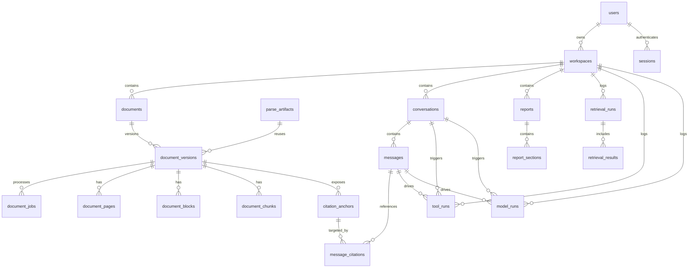

# 律师 AI 助手 ERD

版本：v0.1  
日期：2026-03-28

> 文档角色说明：
>
> - 本文件只负责数据模型、实体关系和字段设计意图。
> - 如果表结构与当前代码或技术设计文档冲突，以当前 Drizzle schema 和 [legal-ai-assistant-technical-design-nodejs.md](/Users/fan/project/tmp/law-doc/docs/legal-ai-assistant-technical-design-nodejs.md) 为准。

## 1. 建模原则

- 资源归属以 `workspace` 为核心。
- 知识库、会话、报告都直接归属于 `workspace`。
- 文档解析缓存按文件内容哈希全局复用，但业务记录和检索索引按 `workspace` 独立。
- 引用跳转依赖 `citation_anchors`，而不是运行时临时拼接页码。

## 2. ERD

## 3. 核心表说明

### 3.1 `users`

用途：

- 用户账号。
- 第一版只服务个人账号，不做多成员组织。

关键约束：

- `username` 全局唯一。

### 3.2 `workspaces`

用途：

- 隔离不同客户、行业、项目主题的主容器。
- 知识库、会话、报告、工具日志、模型日志都挂在这里。

关键约束：

- `user_id + slug` 唯一。

### 3.3 `documents` / `document_versions`

用途：

- `documents` 表示逻辑文件。
- `document_versions` 表示某次上传的具体版本。

关键约束：

- `workspace_id + logical_path` 唯一。
- 一个逻辑文件可以有多个版本。
- `latest_version_id` 指向最新版本。

### 3.4 `parse_artifacts`

用途：

- 解析缓存。
- 保存经 OCR、Docling 处理后的标准化 artifact。

关键约束：

- `sha256` 唯一。
- 不保存工作空间归属。

说明：

- 同一二进制文件在多个工作空间上传时，可以共享解析结果。
- 但 chunk、anchor、Qdrant payload 仍然按工作空间重建。

### 3.5 `document_pages` / `document_blocks` / `document_chunks`

用途：

- `pages` 保存页级信息。
- `blocks` 保存版面块、标题路径、坐标。
- `chunks` 保存最终检索粒度。

设计要点：

- `block` 与 `chunk` 分离，便于后续调整切块策略而不重跑 OCR。
- `chunk` 上要保存 `workspace_id`、`document_id`、`document_version_id`，便于回写和审计。

### 3.6 `citation_anchors`

用途：

- 负责把回答中的 citation 和原文定位绑定起来。

关键字段：

- `document_path`
- `page_no`
- `bbox_json`
- `anchor_label`
- `anchor_text`

说明：

- 这是“可点击引用”的核心表。

### 3.7 `conversations` / `messages`

用途：

- 工作空间内的多轮对话。
- `conversations.agent_session_id` 绑定 Claude Agent SDK session。
- `conversations.agent_workdir` 绑定持久工作目录。

### 3.8 `reports` / `report_sections`

用途：

- 承载长文生成。
- 由 Agent 决策是否进入该流程。

设计要点：

- `reports` 仅作为写作容器，不要求每次问答都产生报告。
- `report_sections` 支持分节生成、重写和局部导出。

### 3.9 `retrieval_runs` / `retrieval_results`

用途：

- 审计每次检索过程。
- 支撑离线评测与线上排错。

### 3.10 `tool_runs` / `model_runs`

用途：

- 保存 Agent 工具调用和模型调用记录。
- 用于调试、成本分析和质量回放。

## 4. 推荐索引

必须有：

- `users.username`
- `workspaces(user_id, slug)`
- `documents(workspace_id, logical_path)`
- `document_versions(document_id, version)`
- `parse_artifacts.sha256`
- `citation_anchors(document_version_id, page_no)`
- `conversations(workspace_id, created_at)`
- `messages(conversation_id, created_at)`
- `reports(workspace_id, created_at)`
- `retrieval_runs(workspace_id, created_at)`
- `tool_runs(workspace_id, created_at)`
- `model_runs(workspace_id, created_at)`

建议有：

- `documents(workspace_id, directory_path)`
- `document_chunks(document_version_id, page_start)`
- `message_citations(message_id, anchor_id)`

## 5. 和 Qdrant 的边界

PostgreSQL 保存：

- 元数据
- 页码与坐标
- 文档目录路径
- 会话、报告、日志

Qdrant 保存：

- chunk vector
- sparse feature
- 最小必要 payload

原则：

- Qdrant 只做检索，不做业务真源。
- 任何可点击引用都必须能回 PostgreSQL 找到 `citation_anchors`。
