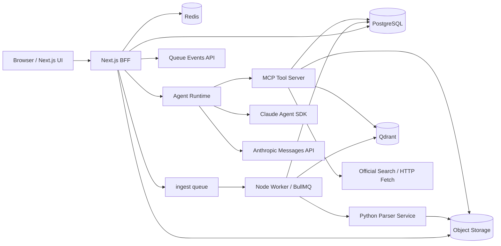

# 律师 AI 助手技术设计（Node.js / Next.js / Claude Agent SDK）

版本：v0.2  
日期：2026-03-28

## 1. 已确认约束

本设计以你刚确认的边界为准：

- 法域以中国法律为主，但产品设计保持通用，不按某个细分业务线定制。
- 不接入付费法律数据库。
- 不接入外部案管、CRM、OA 等系统。
- 不为私有化部署做额外设计。
- 不做团队协作、共享批注、组织级治理。
- 主站和主后端使用 Node.js。
- Web 框架使用 Next.js。
- 文档解析允许使用 Python。
- Agent 的决策与规划固定使用 `@anthropic-ai/claude-agent-sdk`。

因此，第一版产品的核心是：

- 单用户账号体系
- 工作空间级知识库
- 工作空间级会话与报告
- 支持按目录组织资料
- 上传后异步消化
- 基于 MD5/SHA256 的解析缓存
- 基于资料库的带引用问答
- 联网补充搜索
- 由 Agent 自主决定走问答、研究或写作流程

## 2. 选型结论

### 2.1 最终技术栈

- Web + BFF：`Next.js 16 App Router`
- 认证：`Auth.js`
- 业务数据库：`PostgreSQL`
- ORM：`Drizzle ORM`
- 缓存与队列：`Redis + BullMQ`
- 对象存储：`S3 Compatible`（开发期可用 MinIO）
- 向量检索：`Qdrant`
- Agent 规划：`@anthropic-ai/claude-agent-sdk`
- 最终答案结构化输出：`@anthropic-ai/sdk`
- 文档解析：`Python + FastAPI + Docling + PaddleOCR`
- 富文本编辑器：`Tiptap`
- PDF 阅读：`PDF.js`

### 2.2 为什么主检索选 Qdrant，不选 OpenViking

结论：

- `Qdrant` 作为第一版主检索底座。
- `OpenViking` 不进入 MVP 主链路，只作为后续“长期记忆 / agent context filesystem”的候选增强层。

原因：

- Qdrant 已明确支持 dense/sparse hybrid、payload filter、reranking 相关工作流，Node.js 客户端成熟，适合做“工作空间知识库检索”。
- OpenViking 官方把自己定位为 “Context Database for AI Agents”，更接近 agent memory / context filesystem，而不是一个已经成熟替代 Qdrant 的法律 RAG 向量库。
- PyPI 页面当前仍标注 `Development Status :: 3 - Alpha`，而且生态重心偏 Python 与 agent memory。
- 我们当前核心问题是“稳定文档检索 + 可引用回答”，不是“跨任务长期自演化记忆”。

推论：

- 如果后续你要做跨会话长期记忆、检索路径可视化、agent 技能/资源统一管理，再评估把 OpenViking 放在 Agent Memory 层。
- 当前第一版仍然应当把知识库检索建立在 Qdrant 上。

## 3. 总体架构



架构原则：

- Next.js 负责 UI 和轻量 BFF，不直接做重计算。
- 所有长耗时任务都走 BullMQ Worker。
- Agent Runtime 单独成 Node 进程，不跑在无状态 serverless 环境里。
- 文档解析能力单独放到 Python Parser Service。
- 检索证据和最终生成分成两层，避免把所有责任压给 Agent SDK。

## 4. 为什么一定要分成 BFF、Worker、Agent Runtime、Parser

### 4.1 Next.js BFF

负责：

- 页面渲染
- 登录态
- 上传签名
- 任务查询
- 创建对话
- SSE 推流

不负责：

- OCR
- 向量化
- Agent 长循环
- 重报告生成

### 4.2 BullMQ Worker

负责：

- 上传后的异步处理
- 文档切块与入库
- embedding / rerank 接口调用
- 报告导出

理由：

- BullMQ 官方支持 `Worker`、`FlowProducer`、`QueueEvents`，适合把一次文档消化拆成多个子步骤并向前端发送可靠状态。

### 4.3 Agent Runtime

负责：

- 使用 `@anthropic-ai/claude-agent-sdk` 做多步任务规划和工具调用
- 管理会话 session
- 控制不同模式下的 `allowedTools`
- 组织研究模式、报告模式、问答模式

理由：

- Anthropic 官方明确说明 Agent SDK 是长生命周期、持久环境型运行方式，和传统无状态 LLM API 不同。
- 这类进程不适合直接塞进纯 serverless 请求生命周期。

### 4.4 Python Parser Service

负责：

- Docling 解析
- OCR
- 表格和版面结构恢复
- 块与页码/坐标映射

理由：

- 这一层 Python 生态明显更强，Node 侧没有同等级替代。

## 5. 代码组织

建议直接做 `pnpm` monorepo：

```text
.
├─ apps/
│  ├─ web/                 # Next.js 16
│  ├─ worker/              # BullMQ workers
│  └─ agent-runtime/       # Claude Agent SDK host
├─ services/
│  └─ parser/              # Python FastAPI + Docling + OCR
├─ packages/
│  ├─ db/                  # Drizzle schema + migrations
│  ├─ contracts/           # zod DTO / API contracts
│  ├─ queue/               # queue names, payloads, flow builders
│  ├─ storage/             # S3 wrappers
│  ├─ retrieval/           # Qdrant + rerank + query rewrite
│  ├─ agent-tools/         # MCP tool implementations
│  ├─ agent-prompts/       # system prompts / policy prompts
│  ├─ auth/                # Auth.js config
│  └─ ui/                  # shared components
└─ docs/
```

## 6. 运行时设计

### 6.1 Next.js

建议：

- 使用 App Router。
- 所有 API 都走 `app/api/**/route.ts`。
- AI 对话流使用 Route Handler + `ReadableStream` / SSE。
- 需要 Node 能力的路由显式使用 `runtime = "nodejs"`。

### 6.2 Auth.js

第一版建议：

- 用户名密码登录。
- 密码使用 `argon2id` 哈希。
- 会话和 session 仍由 Auth.js 管理。

理由：

- 当前不做团队协作和复杂企业接入，Auth.js 足够。
- Next.js 集成路径清晰，后续如果改登录方式，业务层改动较小。

### 6.3 BullMQ

使用方式：

- `ingest` 用 `FlowProducer` 建多步骤任务树。
- `QueueEvents` 订阅进度并写回 PostgreSQL / Redis。
- CPU 或 I/O 重任务单独 worker 进程，不和 Next.js 共进程。

建议队列：

- `document.ingest`
- `document.parse`
- `document.chunk`
- `document.embed`
- `document.index`
- `report.export`

## 7. 数据模型

当前设计以“用户 -> 工作空间 -> 知识库/会话/报告”为核心，不再把案卷作为系统级强约束对象。

### 7.1 业务表

- `users`
- `sessions`
- `workspaces`
- `documents`
- `document_versions`
- `document_jobs`
- `parse_artifacts`
- `conversations`
- `messages`
- `message_citations`
- `reports`
- `report_sections`
- `tool_runs`
- `model_runs`

### 7.2 关键字段建议

#### `workspaces`

- `id`
- `user_id`
- `title`
- `description`
- `industry`
- `default_mode` (`kb_only` | `kb_plus_web`)
- `created_at`
- `archived_at`

#### `documents`

- `id`
- `workspace_id`
- `title`
- `source_filename`
- `logical_path`
- `directory_path`
- `mime_type`
- `doc_type`
- `status`
- `latest_version_id`
- `created_at`

#### `document_versions`

- `id`
- `document_id`
- `storage_key`
- `sha256`
- `page_count`
- `parse_status`
- `parse_score`
- `ocr_required`
- `metadata_json`
- `created_at`

#### `document_jobs`

- `id`
- `document_version_id`
- `queue_job_id`
- `stage`
- `status`
- `progress`
- `error_code`
- `error_message`
- `created_at`
- `updated_at`

#### `parse_artifacts`

- `id`
- `sha256`
- `artifact_storage_key`
- `page_count`
- `parse_score`
- `parser_version`
- `created_at`

#### `conversations`

- `id`
- `workspace_id`
- `title`
- `agent_session_id`
- `agent_workdir`
- `mode`
- `created_at`

#### `messages`

- `id`
- `conversation_id`
- `role`
- `content_markdown`
- `structured_json`
- `status`
- `created_at`

#### `message_citations`

- `id`
- `message_id`
- `anchor_id`
- `document_id`
- `document_version_id`
- `document_path`
- `page_no`
- `block_id`
- `quote_text`
- `label`

#### `reports`

- `id`
- `workspace_id`
- `title`
- `status`
- `created_at`

### 7.3 检索与锚点表

- `document_pages`
- `document_blocks`
- `document_chunks`
- `citation_anchors`
- `retrieval_runs`
- `retrieval_results`

#### `citation_anchors`

- `id`
- `document_version_id`
- `page_no`
- `block_id`
- `chunk_id`
- `bbox_json`
- `anchor_text`
- `anchor_label`
- `document_path`

`anchor_id` 是整套“点击引用跳原文”的关键主键。

- `title`
- `status`
- `created_at`

### 7.3 目录结构要求

知识库目录是逻辑目录，不改变底层 chunk 的平铺索引方式。

原则：

- 检索层仍然对所有 chunk 平铺检索。
- `directory_path` 主要用于上传管理、文件树浏览、结果过滤和引用展示。
- 回答里的 citation label 默认带上目录路径。

引用展示示例：

```text
资料库/客户A/主合同/2024版/采购主合同.pdf · 第12页 · 第8条
```

前端要求：

- 工作空间文件区支持目录树展示。
- 引用 hover 显示完整逻辑路径。
- 点击引用后，右侧阅读器打开该文件对应版本并跳转到锚点。

## 8. Qdrant 设计

### 8.1 Collection

建议单 collection：

- `legal_chunks`

### 8.2 Payload

```json
{
  "user_id": "usr_xxx",
  "workspace_id": "ws_xxx",
  "document_id": "doc_xxx",
  "document_version_id": "dv_xxx",
  "chunk_id": "chk_xxx",
  "anchor_id": "anc_xxx",
  "doc_type": "contract",
  "page_start": 12,
  "page_end": 13,
  "heading_path": ["主合同", "违约责任", "第8条"],
  "section_label": "第8条",
  "tags": ["合同", "违约"],
  "language": "zh-CN",
  "parse_score": 0.94
}
```

### 8.3 检索策略

第一版固定使用：

- dense 检索
- sparse/BM25 检索
- 规则加权
- rerank

流程：

1. 对用户问题生成主查询、关键词查询、编号查询。
2. 按 `user_id + workspace_id` 强过滤。
3. dense top 30。
4. sparse top 30。
5. 合并后做 rerank top 12。
6. 截取 top 6 作为证据包。
7. 同时返回 `anchor_id`、页码、标题路径和文档标签。

## 9. OpenViking 的定位

OpenViking 可以保留一个未来位置，但不是现在主链路：

- 位置：`agent memory layer`
- 不放在：`knowledge retrieval layer`

如果未来要做：

- 跨工作空间长期记忆
- agent 任务经验沉淀
- 检索轨迹可视化
- 技能、记忆、资源统一成文件系统

可以考虑追加一层 OpenViking。

当前不建议做的事：

- 用 OpenViking 替换 Qdrant 做文档 chunk 主检索。
- 让 OpenViking 承担页面锚点、精确过滤、稳定索引这些法律 RAG 基础设施责任。

## 10. 文档上传与入库流程

### 10.1 API 流程

1. 前端请求 `POST /api/workspaces/:workspaceId/uploads/presign`
2. Next.js 返回 S3 presigned URL
3. 前端直传对象存储
4. 前端调用 `POST /api/workspaces/:workspaceId/documents`
5. BFF 写入 `documents` / `document_versions` / `document_jobs`
6. BFF 创建 BullMQ ingest flow
7. 前端订阅任务状态

上传接口新增字段：

- `directory_path`
- `relative_path`
- `client_md5`（可选）

### 10.2 BullMQ Flow

```text
document.ingest
├─ document.parse
├─ document.chunk
├─ document.embed
└─ document.index
```

每一步都可重试，并把进度同步给前端。

### 10.3 Python Parser Service 输入输出

输入：

- `storage_key`
- `mime_type`
- `workspace_id`
- `document_version_id`
- `sha256`

输出：

- 页面列表
- block 列表
- heading path
- table 结构
- OCR 文本
- 块坐标
- 解析质量评分

Node Worker 收到结果后再执行 chunk、embedding、index。

### 10.4 基于 MD5/SHA256 的解析缓存

目标：

- 避免同一二进制文件被重复 OCR 和重复解析。

实现建议：

1. 上传后由服务端计算 `sha256` 作为最终内容指纹。
2. 如果前端上传了 `client_md5`，仅用于快速预判和秒传提示，不作为最终缓存键。
3. 新增 `parse_artifacts` 表，并对 `sha256` 建唯一索引。
4. Worker 在调用 Python Parser Service 之前先查 `parse_artifacts`：
   - 命中：直接复用解析 artifact
   - 未命中：执行解析，并把 artifact 写回缓存
5. 即使命中缓存，每个 `document_version` 仍独立创建文档记录、chunk 记录、Qdrant payload 和 citation anchor。

建议新增表：

- `parse_artifacts`

字段建议：

- `id`
- `sha256`
- `artifact_storage_key`
- `page_count`
- `parse_score`
- `parser_version`
- `created_at`

注意：

- 这只是“解析缓存”，不是“索引共享”。
- 不同工作空间即使上传相同文件，也保持独立业务记录和独立检索索引。

## 11. Agent 设计

### 11.1 关键原则

- 规划层必须用 `@anthropic-ai/claude-agent-sdk`
- Agent 自主决定走问答、研究还是写作流程
- 但最终答案渲染不强制由 Agent SDK 直接完成
- 引用链路必须由业务系统掌控，不交给自由文本碰运气

这是为了同时满足：

- 你要求的现代 agent 规划能力
- 法律场景要求的可控引用

## 11.2 两阶段回答架构

### 阶段 A：Agent SDK 做规划和取证

Agent SDK 负责：

- 识别用户意图属于问答、研究、写作、总结、合同审查等哪类任务
- 判断是否只查本地库
- 判断是否需要联网
- 选择调用哪些工具
- 汇总证据
- 输出结构化 `evidence dossier`

### 阶段 B：最终回答器做严格引用渲染

使用 `@anthropic-ai/sdk` 的 messages/parse：

- 输入：问题 + evidence dossier
- 输出：结构化回答 JSON
- 由应用层把 citation 渲染成可点击锚点

这样做的好处：

- Agent 仍然负责规划
- 最终答案可以走严格 schema 校验
- citation 一定带 `anchor_id`

## 11.3 为什么不让 Agent SDK 直接自由输出最终答案

不是不能做，而是不够稳：

- 引用格式容易漂移
- 页面锚点不容易严格绑定
- 审计和回放更难

因此建议：

- Agent SDK 负责“找什么、用什么、按什么顺序”
- 最终回答器负责“按固定 schema 产出答案和引用”

## 11.4 Conversation Session 设计

Anthropic 官方文档说明：

- TypeScript `query()` 会自动写 session 到磁盘
- 可用 `resume` 恢复特定 session
- session 与 `cwd` 绑定

因此实现上要做三件事：

1. 每个 `conversation_id` 分配一个固定 `agent_workdir`
2. 持久化 `agent_session_id`
3. `agent-runtime` 容器挂载持久卷保存 session 文件

不建议：

- 把 Agent Runtime 部署成纯无状态 serverless
- 在不同机器之间随意漂移 session 而不迁移 session 文件

## 11.5 Agent 模式

### 问答模式

目标：

- 基于工作空间资料回答

允许工具：

- `mcp__legal__search_workspace_knowledge`
- `mcp__legal__read_citation_anchor`

### 研究模式

目标：

- 当本地资料不足时补外网公开信息

允许工具：

- 问答模式全部工具
- `mcp__legal__search_statutes`
- `mcp__legal__search_web_general`
- `mcp__legal__fetch_source`

### 写作模式

目标：

- 生成报告大纲和分节正文

允许工具：

- 研究模式全部工具
- `mcp__legal__create_report_outline`
- `mcp__legal__write_report_section`

Agent 不应被写死成“先出报告”。

推荐决策规则：

- 如果用户是在问一个具体问题，优先走问答流程。
- 如果用户要求补最新法规、案例、公开信息，走研究流程。
- 如果用户要求生成法律意见、摘要、审查结果、报告，才进入写作流程。
- 写作流程里，是否先出大纲，也由 Agent 根据任务复杂度决定；对于长文默认先出大纲。

## 12. MCP Tool 设计

建议把工具统一注册到一个 `legal` MCP server。

### 12.1 `search_workspace_knowledge`

输入：

```json
{
  "workspace_id": "ws_xxx",
  "query": "不可抗力与违约金是否冲突",
  "filters": {
    "doc_types": ["contract", "memo"]
  },
  "top_k": 8
}
```

输出：

```json
{
  "results": [
    {
      "anchor_id": "anc_001",
      "document_title": "主合同",
      "page_no": 12,
      "section_label": "第8条",
      "snippet": "......",
      "score": 0.93
    }
  ]
}
```

### 12.2 `read_citation_anchor`

输入：

```json
{
  "anchor_id": "anc_001"
}
```

输出：

```json
{
  "anchor_id": "anc_001",
  "document_title": "主合同",
  "page_no": 12,
  "bbox": [0.1, 0.2, 0.7, 0.3],
  "text": "......",
  "context_before": "......",
  "context_after": "......"
}
```

### 12.3 `search_official_sources`

目标：

- 可选的官方来源聚合搜索，用于官方案例库、法院站点等非纯法条来源。

输入：

```json
{
  "query": "民法典 不可抗力 违约责任",
  "domains": ["flk.npc.gov.cn", "court.gov.cn", "rmfyalk.court.gov.cn"],
  "top_k": 5
}
```

输出：

- 标题
- URL
- 摘要
- 来源域名

### 12.4 `search_statutes`

目标：

- 专门搜索法条、司法解释、官方规范性文件。

输入：

```json
{
  "query": "民法典 不可抗力",
  "jurisdiction": "CN",
  "top_k": 5
}
```

输出：

- 标题
- URL
- 生效状态
- 发布机关
- 摘要

### 12.5 `search_web_general`

目标：

- 通用互联网搜索，不限于法规。

输入：

```json
{
  "query": "供应商不可抗力违约责任 最新实务观点",
  "top_k": 5
}
```

输出：

- 标题
- URL
- 摘要
- 来源域名

### 12.6 `fetch_source`

输入：

```json
{
  "url": "https://flk.npc.gov.cn/..."
}
```

输出：

- 规范化正文
- 标题
- 抓取时间
- 段落数组

### 12.7 `create_report_outline`

输入：

- `workspace_id`
- `task`
- `evidence_anchor_ids[]`

输出：

- 标题
- 章节数组

### 12.8 `write_report_section`

输入：

- `report_id`
- `section_id`
- `instruction`
- `evidence_anchor_ids[]`

输出：

- section markdown
- citations[]

## 13. 最终回答器设计

### 13.1 输入

- 原始问题
- mode
- evidence dossier

### 13.2 输出 schema

```json
{
  "answer_markdown": "string",
  "confidence": "high | medium | low",
  "unsupported_reason": "string | null",
  "citations": [
    {
      "anchor_id": "anc_001",
      "label": "《主合同》第8条，第12页",
      "quote_text": "......"
    }
  ],
  "missing_information": ["string"]
}
```

### 13.3 应用层职责

- 校验每条 citation 的 `anchor_id` 是否存在
- 读取 citation 对应的 `document_path`
- 生成 UI 可点击引用
- 写入 `messages` 与 `message_citations`

## 14. Next.js 页面设计

第一版页面只保留最关键工作流：

### 14.1 页面列表

- `/login`
- `/workspaces`
- `/workspaces/new`
- `/workspaces/[workspaceId]`
- `/workspaces/[workspaceId]/documents/[documentId]`
- `/workspaces/[workspaceId]/reports/[reportId]`

### 14.2 `workspaces/[workspaceId]` 页面布局

左右双栏：

- 左栏 40%
  - 对话流
  - 工具状态
  - 快捷动作
  - 上传队列
- 右栏 60%
  - 默认 PDF 阅读器
  - 报告模式切换为富文本编辑器

### 14.3 关键组件

- `ChatThread`
- `Composer`
- `ToolRunTimeline`
- `CitationBadge`
- `DocumentViewer`
- `UploadQueuePanel`
- `OutlineEditor`
- `ReportEditor`

### 14.4 前端状态策略

- 首屏数据：Server Components
- 交互数据：TanStack Query
- 编辑器临时状态：本地 state
- 流式消息：SSE

## 15. API 设计

### 15.1 上传

- `POST /api/workspaces/:workspaceId/uploads/presign`
- `POST /api/workspaces/:workspaceId/documents`
- `GET /api/document-jobs/:jobId`

### 15.2 工作空间

- `GET /api/workspaces`
- `POST /api/workspaces`
- `GET /api/workspaces/:workspaceId`
- `GET /api/workspaces/:workspaceId/documents`

### 15.3 对话

- `POST /api/workspaces/:workspaceId/conversations`
- `GET /api/conversations/:conversationId`
- `POST /api/conversations/:conversationId/messages`
- `GET /api/conversations/:conversationId/stream`

### 15.4 阅读与引用

- `GET /api/documents/:documentId`
- `GET /api/anchors/:anchorId`
- `GET /api/workspaces/:workspaceId/tree`

### 15.5 报告

- `POST /api/workspaces/:workspaceId/reports`
- `POST /api/reports/:reportId/outline`
- `POST /api/reports/:reportId/sections/:sectionId/generate`
- `POST /api/reports/:reportId/export-docx`

## 16. 部署方式

由于 Agent SDK 的官方运行模型是长生命周期、持久环境，不建议第一版部署到纯 serverless 平台。

建议第一版用 Docker Compose 或轻量容器平台部署：

- `web`：Next.js
- `worker`：BullMQ worker
- `agent-runtime`：Claude Agent SDK host
- `parser`：Python parser service
- `postgres`
- `redis`
- `qdrant`
- `minio`

这版部署足够支撑前期试用和迭代。

## 17. 里程碑

### M1：基础设施打底

- Next.js + Auth.js
- PostgreSQL + Drizzle
- Redis + BullMQ
- MinIO/S3
- Qdrant

### M2：文档处理链路

- 上传
- 目录树管理
- 任务状态
- Python parser
- parse artifact cache
- chunk + embedding + indexing
- PDF 阅读与锚点跳转

### M3：问答主链路

- Claude Agent SDK 接入
- MCP legal tools
- evidence dossier
- 最终回答器
- citation 渲染

### M4：联网研究与报告

- search statutes
- general web search
- fetch source
- report outline
- report section generation
- DOCX export

## 18. 当前结论

当前这版设计已经确认以下口径：

1. 解析缓存按 `sha256` 全局复用，但索引和业务记录按工作空间独立创建。
2. 知识库归属于工作空间，会话也归属于工作空间。
3. 第一版目录能力只做逻辑目录树、上传路径、移动和重命名，不做复杂权限。

下一步我可以继续往下做：

- 数据库 ERD
- Drizzle schema 草案
- MCP tool 接口定义
- Next.js 路由与目录结构

## 19. 参考来源

截至 2026-03-28，我主要依据以下官方资料做出以上设计与选型：

- Claude Agent SDK 官方文档：
  - https://platform.claude.com/docs/en/agent-sdk/typescript
  - https://platform.claude.com/docs/en/agent-sdk/sessions
  - https://platform.claude.com/docs/en/agent-sdk/custom-tools
  - https://platform.claude.com/docs/en/agent-sdk/mcp
  - https://platform.claude.com/docs/en/agent-sdk/hosting
- Anthropic TypeScript SDK：
  - https://github.com/anthropics/anthropic-sdk-typescript
- Next.js Route Handlers / Streaming：
  - https://nextjs.org/docs/app/building-your-application/routing/route-handlers
- Auth.js：
  - https://authjs.dev/
- BullMQ：
  - https://docs.bullmq.io/guide/workers
  - https://docs.bullmq.io/guide/flows
  - https://docs.bullmq.io/guide/events
- Qdrant：
  - https://qdrant.tech/documentation/concepts/hybrid-queries/
  - https://qdrant.tech/documentation/advanced-tutorials/reranking-hybrid-search/
- Docling / OCR：
  - https://docling-project.github.io/docling/
  - https://www.paddleocr.ai/latest/en/version3.x/paddlex/quick_start.html
- OpenViking：
  - https://pypi.org/project/openviking/
